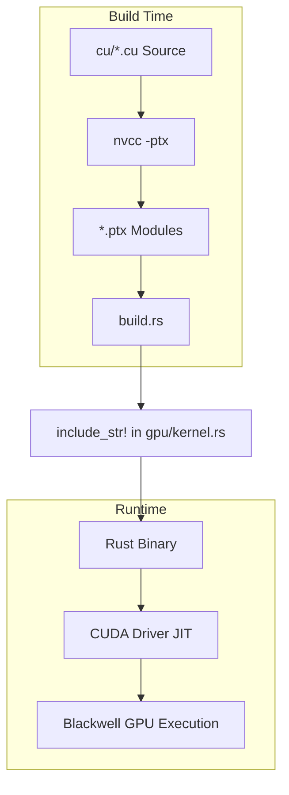
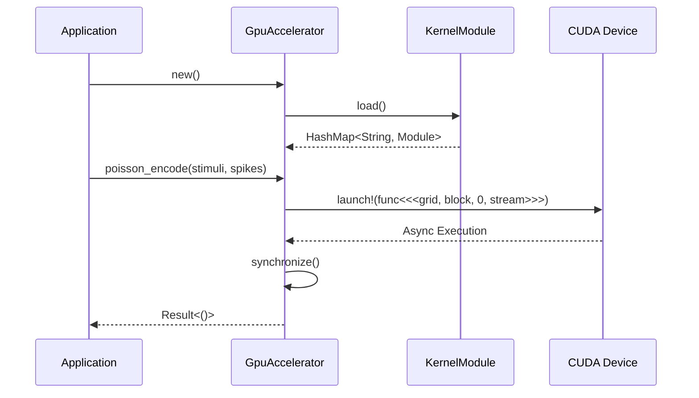

Relevant source files

The following files were used as context for generating this wiki page:

- [README.md](README.md)
- [CLAUDE.md](CLAUDE.md)
- [REVIEW.md](REVIEW.md)
- [src/gpu/accelerator.rs](src/gpu/accelerator.rs)
- [src/gpu/kernel.rs](src/gpu/kernel.rs)
- [src/bitpacking.rs](src/bitpacking.rs)
- [build.rs](build.rs)
- [CMakeLists.txt](CMakeLists.txt)

# Home / Repository Overview

## Introduction
The `myelin-accelerator` repository serves as the low-level compute layer for neuromorphic inference, Boolean Satisfiability (SAT) search, and routing-heavy GPU workloads. It is specifically optimized for Blackwell-class hardware (e.g., RTX 5080) using the `sm_120` target architecture. The project provides safe Rust FFI wrappers around high-performance CUDA kernels, including spiking network simulation, vector similarity search, and a SAT solver.

Sources: [README.md:1-12](README.md#L1-L12), [CLAUDE.md:37-40](CLAUDE.md#L37-L40)

The repository is structured to support both a real GPU execution path (via the `cuda` feature) and a CPU-safe path (default) that uses stubs for environments without a CUDA toolkit. This dual-path architecture ensures that linting and unit tests can run in standard CI environments while full GPU performance is validated on specialized hardware.

Sources: [CLAUDE.md:42-49](CLAUDE.md#L42-L49), [REVIEW.md:200-210](REVIEW.md#L200-L210)

## Architecture and Core Components

The system architecture follows a layered approach, separating host-side orchestration, FFI bindings, and device-side kernel logic.

### Component Map
| Path | Component | Description |
|------|-----------|-------------|
| `src/lib.rs` | Crate Root | Public API re-exports (e.g., `GpuAccelerator`). |
| `src/gpu/` | Real GPU Path | CUDA context management, PTX loading, and kernel launches. |
| `src/gpu_stub.rs` | CPU Fallback | Mock implementations used when the `cuda` feature is disabled. |
| `src/bitpacking.rs`| Bitpacking | Utilities for packing binary (1-bit) and ternary (2-bit) data. |
| `cu/*.cu` | Device Kernels | Spiking network, Similarity, and SAT solver CUDA source code. |
| `build.rs` | Build Script | Invokes `nvcc` to compile `.cu` files to PTX and handles embedding. |

Sources: [README.md:24-34](README.md#L24-L34), [CLAUDE.md:42-49](CLAUDE.md#L42-L49)

### Compilation and Embedding Flow
The project uses `build.rs` to drive the compilation of CUDA kernels into Parallel Thread Execution (PTX) modules. These modules are then embedded directly into the Rust binary using `include_str!`.

The CUDA kernels are JIT-compiled by the CUDA driver upon the first call to `KernelModule::load()`.
Sources: [src/gpu/kernel.rs:16-30](src/gpu/kernel.rs#L16-L30), [build.rs:60-90](build.rs#L60-L90)

## GPU Management and Acceleration

### GpuAccelerator
The `GpuAccelerator` is the primary interface for users. It manages the `GpuContext`, `KernelModule` (loaded kernels), and a CUDA `Stream` for asynchronous execution. It handles feature-gating to fall back gracefully to a non-functional state if no GPU is detected during initialization.

Sources: [src/gpu/accelerator.rs:18-70](src/gpu/accelerator.rs#L18-L70)

### Kernel Modules
Kernels are organized into specific modules:
*  **Spiking Network:** Includes `poisson_encode`, `lif_step`, and `stdp_update`.
*  **Vector Similarity:** Includes `cosine_similarity_batched` and `cosine_similarity_top_k`.
*  **SAT Solver:** Includes `satsolver_step`, `satsolver_extract`, and reduction passes.

Sources: [src/gpu/kernel.rs:50-95](src/gpu/kernel.rs#L50-L95)

Sources: [src/gpu/accelerator.rs:40-60](src/gpu/accelerator.rs#L40-L60), [src/gpu/accelerator.rs:240-265](src/gpu/accelerator.rs#L240-L265)

## Data Handling and Bitpacking

To maximize throughput on Blackwell hardware, the repository utilizes custom bitpacking for binary and ternary values. This reduces VRAM footprint and memory bandwidth requirements.

### Bitpacking Specifications
*  **Binary (1-bit):** 32 values packed into a `u32`. Bit `i` of word `w` represents element `w * 32 + i`.
*  **Ternary (2-bit):** 16 values packed into a `u32`. Encoding: `0` (0b00), `+1` (0b01), `-1` (0b10).

Sources: [src/bitpacking.rs:7-25](src/bitpacking.rs#L7-L25)

### Memory Discipline
The project adheres to a "16 GB VRAM discipline." Kernel footprints are kept static and bounded; large memory allocations are expected to be managed by user tensors, while the accelerator crate handles temporary scratch space for operations like reductions.
Sources: [README.md:14-17](README.md#L14-L17), [src/gpu/accelerator.rs:190-210](src/gpu/accelerator.rs#L190-L210)

## Build System and Tooling

The project employs a dual build system strategy to accommodate both Rust ecosystem tools and C++ IDE integrations like CLion.

### Build Tools Integration
| Tool | Role | Configuration |
|------|------|---------------|
| `Cargo` | Primary Build | Uses `build.rs` to compile PTX and manage Rust dependencies. |
| `CMake` | IDE / Linting | Rewritten to `CXX`-only to drive `nvcc` via `add_custom_command` to avoid host-compiler incompatibilities. |
| `CTest` | Test Runner | Wraps `cargo test`, `clippy`, and `cuda_kernel_build` for CI/CD. |

Sources: [REVIEW.md:9-30](REVIEW.md#L9-L30), [CMakeLists.txt:1-15](CMakeLists.txt#L1-L15)

### CUDA Versioning
For Blackwell (`sm_120`), the build system ensures a PTX ISA floor of `9.2`. If an environment variable `MYELIN_PTX_VERSION` is set below this for `sm_120`, the build script automatically clamps it to `9.2` to prevent JIT `InvalidPtx` errors.
Sources: [build.rs:17-20](build.rs#L17-L20), [build.rs:100-115](build.rs#L100-L115)

## Conclusion
`myelin-accelerator` provides a specialized, high-performance foundation for neuromorphic and SAT-based applications on modern NVIDIA hardware. By utilizing a hybrid build system, strict bitpacking, and Blackwell-specific optimizations, it offers a robust FFI layer that balances development ease (via CPU stubs) with maximum hardware utilization.
Sources: [README.md:65-75](README.md#L65-L75), [REVIEW.md:180-195](REVIEW.md#L180-L195)
