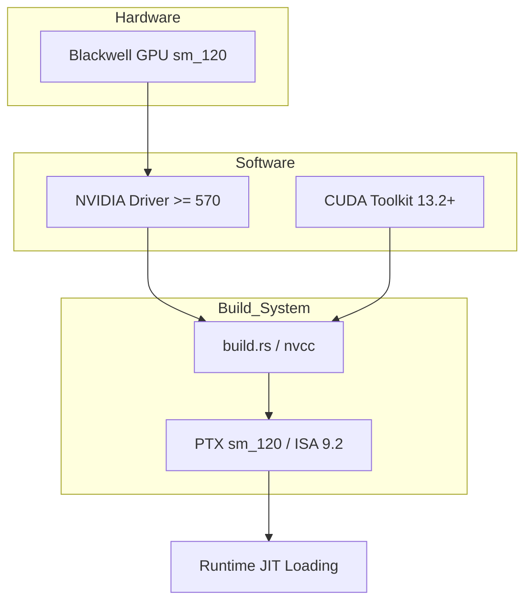

<details>
<summary>Relevant source files</summary>

The following files were used as context for generating this wiki page:

- [README.md](README.md)
- [CLAUDE.md](CLAUDE.md)
- [REVIEW.md](REVIEW.md)
- [build.rs](build.rs)
- [src/gpu/kernel.rs](src/gpu/kernel.rs)
- [examples/benchmark.rs](examples/benchmark.rs)
- [CMakeLists.txt](CMakeLists.txt)
</details>

# Hardware & VRAM Requirements

The `myelin-accelerator` project is designed as a high-performance compute layer specifically optimized for NVIDIA Blackwell architecture GPUs. It focuses on neuromorphic inference, SAT search, and routing-heavy workloads, necessitating specific hardware features and driver versions to function correctly when the `cuda` feature is enabled.

This page details the specific GPU architectures supported, the required software stack (drivers and toolkits), and the memory management discipline enforced by the kernel designs.

## GPU Architecture Support

The project primary target is the `sm_120` compute capability, which corresponds to the NVIDIA Blackwell architecture (e.g., RTX 5080-class hardware). While the codebase includes a CPU-safe stub path for development and CI environments, actual GPU acceleration requires modern NVIDIA hardware.

### Primary Target: sm_120
The kernels are built and tuned specifically for `sm_120` to ensure optimal Streaming Multiprocessor (SM) occupancy.
Sources: [README.md:9-10](README.md#L9-L10), [CLAUDE.md:27-28](CLAUDE.md#L27-L28), [REVIEW.md:275-276](REVIEW.md#L275-L276)

### Hardware Compatibility Table

| Component | Requirement | Notes |
|-----------|-------------|-------|
| **GPU Generation** | Blackwell (RTX 5080+) | Primary target for `sm_120` kernels |
| **Compute Capability**| `sm_120` | Minimum target for Blackwell optimization |
| **ISA Version** | PTX ISA ≥ 9.0 | Required for `sm_120` compatibility |
| **Address Size** | 64-bit | Standard for modern CUDA applications |

Sources: [README.md:9](README.md#L9), [build.rs:13](build.rs#L13), [CLAUDE.md:28](CLAUDE.md#L28), [REVIEW.md:276](REVIEW.md#L276)

## Software Stack Requirements

To utilize the GPU path, the host system must meet specific driver and toolkit versions. The project uses a custom build process that avoids native CMake CUDA language to bypass compiler-identification incompatibilities with newer `libstdc++` versions.

### Required Versions
*  **NVIDIA Driver:** Version ≥ 570 (Unified Memory Driver 13.x).
*  **CUDA Toolkit:** Version 13.2+ is preferred; local baselines use 13.3.1.
*  **JIT Compilation:** The CUDA driver must support JIT-compiling `sm_120` PTX modules.

Sources: [CLAUDE.md:37-38](CLAUDE.md#L37-L38), [REVIEW.md:231-233](REVIEW.md#L231-L233), [src/gpu/kernel.rs:142-143](src/gpu/kernel.rs#L142-L143)

### Dependency Flow for GPU Features
The following diagram illustrates how hardware and software dependencies interact to enable the `cuda` feature path.



This diagram shows the relationship between hardware targets and the build-time requirements needed to produce functional PTX modules.
Sources: [CLAUDE.md:33-38](CLAUDE.md#L33-L38), [build.rs:13-17](build.rs#L13-L17), [src/gpu/kernel.rs:137-145](src/gpu/kernel.rs#L137-L145)

## VRAM & Memory Discipline

The project adheres to a "16 GB VRAM discipline." This design philosophy ensures that kernel footprints remain static and bounded, preventing the accelerator from consuming excessive memory for temporary operations.

### Memory Characteristics
*  **Static Footprint:** Kernel scratch space and internal requirements are kept to a minimum.
*  **User Management:** The majority of VRAM consumption is attributed to user-managed tensors, not the internal operations of the `myelin-accelerator`.
*  **Vectorized Loads:** For optimal performance, users should ensure 16-byte alignment for packed buffers to support 128-bit vectorized loads in CUDA.

Sources: [README.md:11-12](README.md#L11-L12), [src/bitpacking.rs:27-28](src/bitpacking.rs#L27-L28)

### GPU Info Reporting
The `benchmark` example can be used to verify the detected hardware and VRAM capacity.

```rust
// Logic from examples/benchmark.rs to collect GPU metadata
#[cfg(feature = "cuda")]
fn collect_gpu_info() -> Option<GpuInfo> {
    // ... logic using cust to query device ...
    Some(GpuInfo {
        device_name,
        driver_version: driver_cuda_api,
        cuda_version: cuda_toolkit,
        sm_arch: format!("sm_{major}{minor}"),
        vram_total_mb: total_bytes / (1024 * 1024),
    })
}
```

Sources: [examples/benchmark.rs:245-280](examples/benchmark.rs#L245-L280)

## CPU-Safe Fallback (Stub Path)

If no compatible hardware or driver is present, the project compiles using a "stub" path (default behavior when the `cuda` feature is disabled). In this mode, no CUDA toolkit is required, and all GPU-related calls return a `GpuError::NoGpu`.

### Stub vs. GPU Comparison

| Feature | `cuda` Feature OFF (Default) | `cuda` Feature ON |
|---------|-----------------------------|-------------------|
| **Toolkit Requirement** | None | CUDA 13.2+ |
| **Hardware Requirement** | Any CPU | Blackwell GPU |
| **Output** | Stub PTX files (`sm_80`) | Real PTX files (`sm_120`) |
| **Backend** | `src/gpu_stub.rs` | `src/gpu/` |

Sources: [CLAUDE.md:33-38](CLAUDE.md#L33-L38), [build.rs:9-10](build.rs#L9-L10), [README.md:28-32](README.md#L28-L32)

## Summary of Hardware Verification

To verify that the hardware meets the requirements, users should run the benchmark example with both `bench` and `cuda` features enabled. A successful run on Blackwell hardware should report approximately 5 µs latency for core kernels like `poisson_encode_4096`.

Sources: [REVIEW.md:244-249](REVIEW.md#L244-L249), [examples/benchmark.rs:29-33](examples/benchmark.rs#L29-L33)
