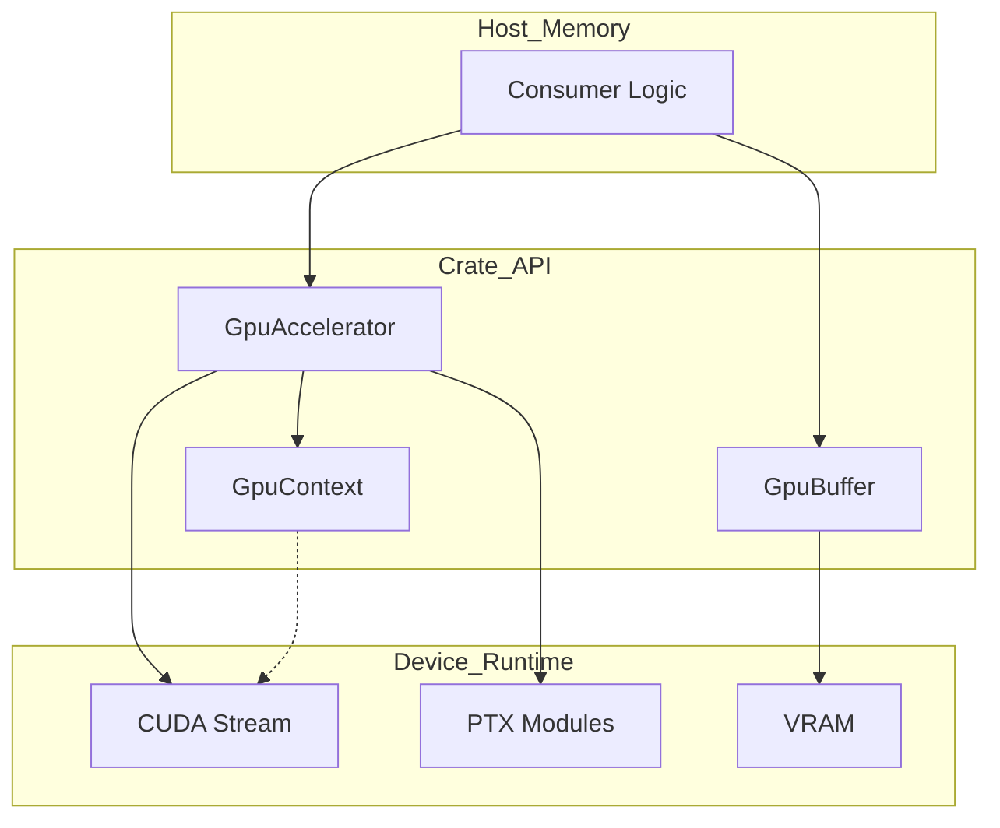
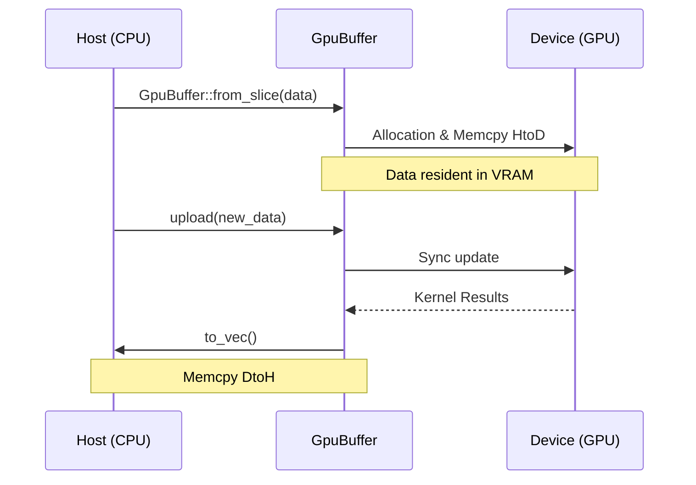
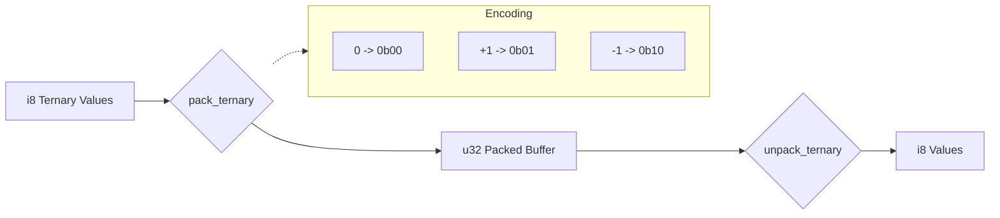

<details>
<summary>Relevant source files</summary>

The following files were used as context for generating this wiki page:

- [README.md](README.md)
- [src/lib.rs](src/lib.rs)
- [Cargo.toml](Cargo.toml)
- [src/gpu/accelerator.rs](src/gpu/accelerator.rs)
- [src/gpu/kernel.rs](src/gpu/kernel.rs)
- [src/bitpacking.rs](src/bitpacking.rs)
- [src/gpu_stub.rs](src/gpu_stub.rs)
- [tests/api_contract.rs](tests/api_contract.rs)
</details>

# Consumer Integration Guide

## Introduction

The `myelin-accelerator` crate serves as the low-level compute layer for neuromorphic inference, SAT search, and routing-heavy GPU workloads. It provides safe Rust FFI wrappers for CUDA kernels optimized for Blackwell / RTX 5080-class hardware (`sm_120`). Consumers interface with the library through high-level abstractions like `GpuAccelerator` and `GpuBuffer`, ensuring ABI consistency with the underlying CUDA PTX modules.

The library is designed with a dual-path architecture: a real GPU path leveraging the `cuda` feature and a CPU-safe stub path for environments without CUDA toolkits or drivers. This ensures that integration remains functional across different development and deployment environments, allowing consumers to implement fallback logic when specialized hardware is unavailable.

Sources: [README.md:3-9](README.md#L3-L9), [Cargo.toml:15-18](Cargo.toml#L15-L18), [src/gpu_stub.rs:43-51](src/gpu_stub.rs#L43-L51)

## Dependency Configuration

To integrate `myelin-accelerator` into a Rust project, consumers must define the dependency in their `Cargo.toml`. The crate supports optional features to toggle between stubbed functionality and full CUDA acceleration.

### Feature Selection

| Feature | Description | Dependencies Added |
| :--- | :--- | :--- |
| `default` | Provides CPU-safe stubs; no `nvcc` or GPU driver required. | `anyhow`, `tracing` |
| `cuda` | Enables real GPU execution path and PTX JIT loading. | `cust`, `nvtx` |
| `bench` | Enables serialization for benchmarking and reports. | `serde`, `serde_json` |

Sources: [README.md:27-33](README.md#L27-L33), [Cargo.toml:15-26](Cargo.toml#L15-L26)

### Installation Snippets

```toml
[dependencies]
# Standard integration (CPU stub path)
myelin-accelerator = "0.1.0"

# GPU-enabled integration
myelin-accelerator = { version = "0.1.0", features = ["cuda"] }
```

Sources: [README.md:50-54](README.md#L50-L54)

## Core Component Architecture

The integration model revolves around three primary entities: the Accelerator, the Context, and Buffers. 

### Component Relationship Diagram
The following diagram illustrates how consumers interact with the high-level API to manage GPU resources and kernel execution.



Sources: [src/gpu/accelerator.rs:18-24](src/gpu/accelerator.rs#L18-L24), [src/gpu/kernel.rs:30-33](src/gpu/kernel.rs#L30-L33)

### The Accelerator Lifecycle
`GpuAccelerator` is the primary entry point for launching kernels. It manages the `KernelModule` loading and the underlying CUDA `Stream`.

1.  **Instantiation**: Using `GpuAccelerator::new()` or `Default::default()`.
2.  **Hardware Check**: The `is_ready()` method indicates if a valid GPU context and modules are loaded.
3.  **Execution**: Kernel launches are provided as methods (e.g., `poisson_encode`, `satsolver_extract`).
4.  **Synchronization**: The `synchronize()` method ensures all pending operations in the stream are complete.

Sources: [src/gpu/accelerator.rs:26-80](src/gpu/accelerator.rs#L26-L80), [src/gpu_stub.rs:125-132](src/gpu_stub.rs#L125-L132)

## Data Management with GpuBuffer

`GpuBuffer<T>` handles memory allocation and data transfer between host (RAM) and device (VRAM). 

### Buffer Workflow



Sources: [src/gpu/accelerator.rs:191-197](src/gpu/accelerator.rs#L191-L197), [src/gpu_stub.rs:75-103](src/gpu_stub.rs#L75-L103)

### Key Methods
*  `alloc(len)`: Reserves memory on the device.
*  `from_slice(&[T])`: Allocates and immediately initializes device memory from host data.
*  `upload(&[T])`: Updates existing device memory. It performs a length check and returns `GpuError::MemoryError` on mismatch.
*  `to_vec()`: Pulls data back to the host for processing.

Sources: [src/gpu_stub.rs:75-115](src/gpu_stub.rs#L75-L115), [tests/api_contract.rs:60-75](tests/api_contract.rs#L60-L75)

## Spiking Network and SAT Solver Integration

The accelerator provides specialized interfaces for neuromorphic and logic solving workloads.

### Spiking Network: Poisson Encoding
The Poisson encoding kernel converts float stimuli into spike bitmasks. Consumers provide a `GpuBuffer<f32>` of stimuli and receive a `GpuBuffer<u32>` of spikes.

```rust
let acc = GpuAccelerator::new();
let stimuli = GpuBuffer::from_slice(&[0.5f32; 4096]).unwrap();
let mut spikes = GpuBuffer::<u32>::alloc(4096).unwrap();
acc.poisson_encode(&stimuli, &mut spikes, 42).unwrap();
```

Sources: [src/gpu/accelerator.rs:271-299](src/gpu/accelerator.rs#L271-L299), [examples/benchmark.rs:331-344](examples/benchmark.rs#L331-L344)

### SAT Solver: Extract and Reduce
The SAT solver utilizes a two-pass reduction strategy for finding the best "walker" (score/assignment pair). Consumers must manage large assignment buffers and SAT flags.

| Function | Purpose | Key Parameters |
| :--- | :--- | :--- |
| `satsolver_extract` | Retrieves the variable assignment of the best walker. | `assignment`, `best_walker`, `output` |
| `satsolver_aux_reduce_best` | Synchronously updates auxiliary scores and identifies the best walker. | `sat_flags`, `scores`, `best_score`, `clauses` |

Sources: [src/gpu/accelerator.rs:129-215](src/gpu/accelerator.rs#L129-L215), [src/gpu/kernel.rs:79-87](src/gpu/kernel.rs#L79-L87)

## Bitpacking Utilities

For high-performance routing and memory efficiency, `myelin-accelerator` includes a `bitpacking` module for host-side transformation of binary and ternary values.

*  **Binary (1-bit)**: Packs 32 values per `u32` word. Used for dense bit vectors.
*  **Ternary (2-bit)**: Packs 16 values per `u32` word using a specific encoding: `0` (`0b00`), `+1` (`0b01`), and `-1` (`0b10`).

### Bitpacking Logic



Sources: [src/bitpacking.rs:18-30](src/bitpacking.rs#L18-L30), [src/bitpacking.rs:90-112](src/bitpacking.rs#L90-L112)

## Error Handling

All GPU operations return a `GpuResult<T>`, wrapping a `GpuError`. Consumers should handle these errors to provide fallback paths or debugging info.

| Error Variant | Meaning |
| :--- | :--- |
| `NoGpu` | Crate built without `cuda` feature or no hardware detected. |
| `ModuleLoadFailed` | CUDA JIT compilation of PTX failed (often driver mismatch). |
| `KernelNotFound` | A specific symbol was missing in the loaded module. |
| `MemoryError` | Buffer length mismatches or allocation failures. |
| `LaunchFailed` | CUDA kernel execution or stream synchronization failed. |

Sources: [src/gpu_stub.rs:12-22](src/gpu_stub.rs#L12-L22), [src/gpu_stub.rs:25-36](src/gpu_stub.rs#L25-L36)

## Conclusion

Integrating `myelin-accelerator` allows consumers to offload complex neuromorphic and combinatorial search tasks to Blackwell GPUs. By utilizing the `GpuAccelerator` for kernel management, `GpuBuffer` for memory safety, and `bitpacking` for data efficiency, developers can leverage high-performance CUDA kernels through a type-safe Rust interface. The presence of the CPU-safe stub path further ensures that applications remain portable across environments while targeting peak performance on NVIDIA hardware.

Sources: [README.md:37-45](README.md#L37-L45), [src/gpu/accelerator.rs:30-58](src/gpu/accelerator.rs#L30-L58)
