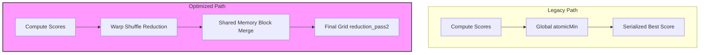
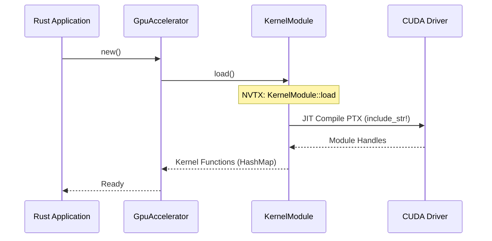

Relevant source files

The following files were used as context for generating this wiki page:

- [README.md](README.md)
- [REVIEW.md](REVIEW.md)
- [CLAUDE.md](CLAUDE.md)
- [CMakeLists.txt](CMakeLists.txt)
- [build.rs](build.rs)
- [Cargo.toml](Cargo.toml)
- [src/gpu/kernel.rs](src/gpu/kernel.rs)
- [src/gpu/accelerator.rs](src/gpu/accelerator.rs)
- [examples/benchmark.rs](examples/benchmark.rs)

# Changelog & Optimizations

The `myelin-accelerator` project has undergone significant architectural refinements to target Blackwell-class GPUs (`sm_120`) and improve build-system reliability. These optimizations focus on eliminating global synchronization bottlenecks in CUDA kernels, streamlining the Rust-CUDA FFI, and ensuring compatibility with modern host toolchains (GCC 16 / libstdc++).

The primary scope of these changes covers the low-level compute layer, specifically the PTX module generation, JIT loading paths, and high-performance reduction strategies for SAT solving and vector similarity.

## Kernel Performance Optimizations

Recent updates have targeted SM (Streaming Multiprocessor) occupancy and the removal of serialized global operations.

### SAT Solver Reduction
The `satsolver.cu` kernel has been refactored to remove `atomicMin` from its hot reduction path. Instead of global atomic serialization, it now utilizes warp shuffles and shared memory for block-local reductions. Results are written once per block before a final global reduction pass, significantly improving performance on high-core-count Blackwell hardware.
Sources: [README.md:14-15](README.md#L14-L15), [README.md:38-40](README.md#L38-L40)

### Vector Similarity & Routing
The `vector_similarity.cu` kernel has moved from a single-thread selection tail to a warp-participating top-k reduction. Candidate values are now kept register-resident during merge stages, preventing unnecessary global memory round-trips for routing-heavy workloads like Mixture of Experts (MoE).
Sources: [README.md:16-17](README.md#L16-L17), [README.md:41-43](README.md#L41-L43)

*The diagram shows the transition from serialized global atomics to hierarchical parallel reduction.*

## Build System & Tooling Improvements

The build system was redesigned to handle incompatibilities between `nvcc` and modern host compilers while maintaining a "CPU-safe" default path.

### CMake Workaround for GCC 16
CMake's native `project(... CUDA)` language identification was found to fail on hosts with GCC 16 due to libstdc++ C++23 constructs that `nvcc` cannot parse. To resolve this, `CMakeLists.txt` was rewritten to treat the project as `CXX` only, driving `nvcc` through `add_custom_command` to compile `.cu` files directly to PTX.
Sources: [REVIEW.md:12-25](REVIEW.md#L12-L25), [CMakeLists.txt:5-23](CMakeLists.txt#L5-L23)

### PTX Versioning & Blackwell Compatibility
A critical bug was fixed where `build.rs` defaulted PTX versioning to `8.5`, which is incompatible with `sm_120`. The build script now enforces a floor of PTX ISA `9.2` for Blackwell architectures to prevent `InvalidPtx` errors during JIT compilation.
Sources: [REVIEW.md:78-83](REVIEW.md#L78-L83), [build.rs:13-16](build.rs#L13-L16), [build.rs:141-160](build.rs#L141-L160)

| Component | Optimization / Fix | File Reference |
|-----------|--------------------|----------------|
| **CMake** | Switched from native CUDA to Custom CXX commands | [CMakeLists.txt:30-45](CMakeLists.txt#L30-L45) |
| **build.rs** | Implemented `.version 9.2` floor for `sm_120` | [build.rs:148-155](build.rs#L148-L155) |
| **.gitignore** | Tracked `CMakeLists.txt`, ignored binary artifacts | [REVIEW.md:46-52](REVIEW.md#L46-L52) |
| **Linting** | Enforced `--locked` and `--no-default-features` in CTest | [CMakeLists.txt:75-105](CMakeLists.txt#L75-L105) |

## API & Instrumentation Refinements

The interaction between Rust and CUDA has been hardened with better error handling and profiling integration.

### NVTX Profiling Restoration
The `nvtx` integration was previously broken due to an invalid `macros` feature flag in `Cargo.toml`. This has been fixed, and `KernelModule::load()` is now instrumented with `range_push!` and `range_pop!` to allow precise timeline analysis in Nsight Systems.
Sources: [REVIEW.md:58-65](REVIEW.md#L58-L65), [src/gpu/kernel.rs:44-50](src/gpu/kernel.rs#L44-L50)

### GpuAccelerator Internal Logic
The `GpuAccelerator` now manages partial results for SAT solver reductions using internal `RefCell` buffers (`aux_partial_scores`, `aux_partial_walkers`). This allows for dynamic reallocation of scratch space if the grid size increases between launches while maintaining an immutable public API.
Sources: [src/gpu/accelerator.rs:25-30](src/gpu/accelerator.rs#L25-L30), [src/gpu/accelerator.rs:195-215](src/gpu/accelerator.rs#L195-L215)

*The sequence diagram illustrates the JIT loading process of compile-time embedded PTX modules.*

## Quality Gate Strategy

A "Local-First" quality gate strategy was implemented to handle the lack of Blackwell hardware in standard cloud CI environments.

*  **CPU-Safe Path (Default):** Uses `src/gpu_stub.rs`. Requires no CUDA toolkit or GPU. Validated via `cargo test --locked`.
*  **GPU Path (`--features cuda`):** Invokes `nvcc`. Requires driver ≥ 570 for `sm_120`. Validated through `cargo test --features cuda -- --ignored` (unit tests for JIT load) and `benchmark.rs` (runtime performance).
Sources: [CLAUDE.md:14-25](CLAUDE.md#L14-L25), [REVIEW.md:88-100](REVIEW.md#L88-L100), [REVIEW.md:162-178](REVIEW.md#L162-L178)

### Benchmark Harness Enhancements
The benchmark example was updated to provide real GPU telemetry (`collect_gpu_info`) only when the `cuda` feature is active. It now supports baseline comparisons and emits both JSON and CSV results for performance regression tracking.
Sources: [REVIEW.md:69-76](REVIEW.md#L69-L76), [examples/benchmark.rs:248-295](examples/benchmark.rs#L248-L295)

## Conclusion
The optimizations within `myelin-accelerator` transition the project from a generic CUDA implementation to a Blackwell-optimized backend. By moving to hierarchical reductions, fixing build-time ISA mismatches, and providing a robust stubbing system for non-GPU environments, the project ensures high SM occupancy and developer productivity across varying host configurations.
Sources: [README.md:45-50](README.md#L45-L50), [REVIEW.md:235-250](REVIEW.md#L235-L250)
