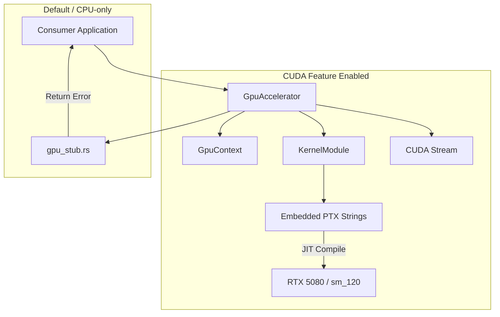
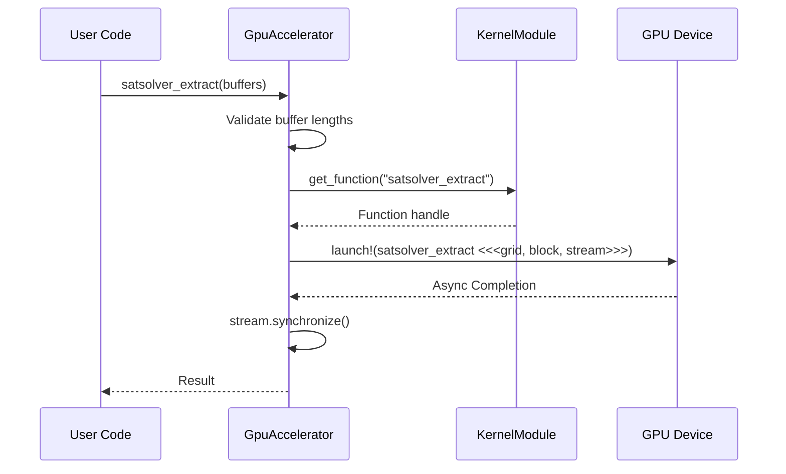

Relevant source files

The following files were used as context for generating this wiki page:

- [README.md](README.md)
- [src/gpu/accelerator.rs](src/gpu/accelerator.rs)
- [src/gpu/kernel.rs](src/gpu/kernel.rs)
- [src/bitpacking.rs](src/bitpacking.rs)
- [src/gpu_stub.rs](src/gpu_stub.rs)
- [build.rs](build.rs)
- [CLAUDE.md](CLAUDE.md)

# Architecture Overview

The `myelin-accelerator` project serves as a low-level compute layer designed for neuromorphic inference, SAT search, and routing-heavy GPU workloads. It specifically targets Blackwell-class hardware (RTX 5080, `sm_120`) while maintaining a static 16 GB VRAM footprint discipline. The system provides Blackwell-first CUDA kernels, safe Rust FFI wrappers, and bitpacking utilities for host-side data preparation.

Sources: [README.md:1-12](README.md#L1-L12), [CLAUDE.md:27-35](CLAUDE.md#L27-L35)

The architecture is divided into two primary paths: a high-performance GPU path utilizing the `cust` and `nvtx` crates for hardware acceleration, and a CPU-safe stub path for CI, sandboxed environments, and systems without a CUDA toolkit.

Sources: [CLAUDE.md:27-40](CLAUDE.md#L27-L40), [src/gpu_stub.rs:1-30](src/gpu_stub.rs#L1-L30)

## Core Components

The system is structured into several modular layers that handle hardware interaction, kernel management, and data encoding.

### System Components Summary

| Component | Responsibility | File Path |
|-----------|----------------|-----------|
| `GpuAccelerator` | Main entry point for launching GPU tasks and managing streams. | `src/gpu/accelerator.rs` |
| `KernelModule` | Manages JIT-compiled PTX modules and kernel function handles. | `src/gpu/kernel.rs` |
| `GpuBuffer` | Handles device memory allocation and host-device data transfers. | `src/gpu/memory.rs` |
| `bitpacking` | Provides binary (1-bit) and ternary (2-bit) encoding for dense vectors. | `src/bitpacking.rs` |
| `gpu_stub` | CPU-safe stand-ins for all GPU types when the `cuda` feature is disabled. | `src/gpu_stub.rs` |

Sources: [README.md:32-45](README.md#L32-L45), [src/gpu/accelerator.rs:1-30](src/gpu/accelerator.rs#L1-L30)

### Hardware Abstraction Flow

The following diagram illustrates how the `GpuAccelerator` coordinates between the CUDA context, kernel modules, and command streams.

Sources: [README.md:32-45](README.md#L32-L45), [src/gpu/accelerator.rs:34-75](src/gpu/accelerator.rs#L34-L75), [src/gpu/kernel.rs:15-30](src/gpu/kernel.rs#L15-L30)

## Kernel Management and JIT Compilation

Kernels are written in CUDA C++ and compiled into PTX (Parallel Thread Execution) assembly during the build process. These PTX files are embedded directly into the Rust binary using `include_str!`, ensuring that no external files are required at runtime.

Sources: [src/gpu/kernel.rs:15-30](src/gpu/kernel.rs#L15-L30), [build.rs:114-168](build.rs#L114-L168)

### PTX Modules
The `KernelModule` struct maintains a mapping of function names to their respective loaded modules. The primary modules include:
*  **Spiking Network**: Functions like `poisson_encode`, `lif_step`, and `stdp_update`.
*  **Vector Similarity**: Includes `cosine_similarity_batched` and `cosine_similarity_top_k`.
*  **SAT Solver**: Contains `satsolver_step`, `satsolver_aux_update`, and reduction passes.

Sources: [src/gpu/kernel.rs:55-90](src/gpu/kernel.rs#L55-L90)

### JIT Process
When `KernelModule::load()` is invoked, the CUDA driver performs Just-In-Time (JIT) compilation of the embedded PTX strings. For Blackwell hardware (`sm_120`), the build system ensures a minimum PTX ISA version of 9.0 (typically 9.2).

Sources: [src/gpu/kernel.rs:105-115](src/gpu/kernel.rs#L105-L115), [build.rs:170-205](build.rs#L170-L205)

## Data Encoding (Bitpacking)

To optimize memory bandwidth and storage, the project implements host-side bitpacking for binary and ternary values.

### Bitpacking Layouts
*  **Binary (1-bit)**: Each `u32` word holds 32 values. A set bit indicates `1` or `true`.
*  **Ternary (2-bit)**: Each `u32` word holds 16 values using a specific encoding scheme.

| Code | Ternary Value | Description |
|------|---------------|-------------|
| `0b00` | `0` | Default zero |
| `0b01` | `+1` | Positive unit |
| `0b10` | `-1` | Negative unit |
| `0b11` | `0` | Reserved/Decoded as zero |

Sources: [src/bitpacking.rs:1-25](src/bitpacking.rs#L1-L25), [src/bitpacking.rs:82-95](src/bitpacking.rs#L82-L95)

## Compute Execution Model

Execution is primarily asynchronous, leveraging CUDA streams to prevent serializing work through a single thread.

### Kernel Launch Sequence
The `GpuAccelerator` provides high-level methods that wrap the unsafe `launch!` macro. The sequence for a typical operation, such as the SAT solver extraction, involves length validation, kernel retrieval, and grid/block dimension calculation.

Sources: [src/gpu/accelerator.rs:105-145](src/gpu/accelerator.rs#L105-L145), [src/gpu/accelerator.rs:275-290](src/gpu/accelerator.rs#L275-L290)

## Build System and Versioning

The `build.rs` and `CMakeLists.txt` files coordinate the compilation of `.cu` files using `nvcc`. 

*  **Blackwell Optimization**: The build script detects the target architecture and applies a PTX version floor of 9.2 for `sm_120` to prevent `InvalidPtx` errors during JIT compilation.
*  **CPU Stubbing**: If the `cuda` feature is disabled, the build script generates empty stub PTX files, and the crate compiles against `src/gpu_stub.rs`.

Sources: [build.rs:50-80](build.rs#L50-L80), [CLAUDE.md:27-40](CLAUDE.md#L27-L40), [REVIEW.md:235-250](REVIEW.md#L235-L250)

## Summary

The `myelin-accelerator` architecture provides a robust interface between high-level Rust logic and low-level Blackwell GPU kernels. By embedding PTX and providing a comprehensive stubbing system, it ensures portability and ease of testing across different hardware environments while maintaining the performance required for neuromorphic and SAT solving workloads.

Sources: [README.md:5-25](README.md#L5-L25), [CLAUDE.md:27-35](CLAUDE.md#L27-L35)
