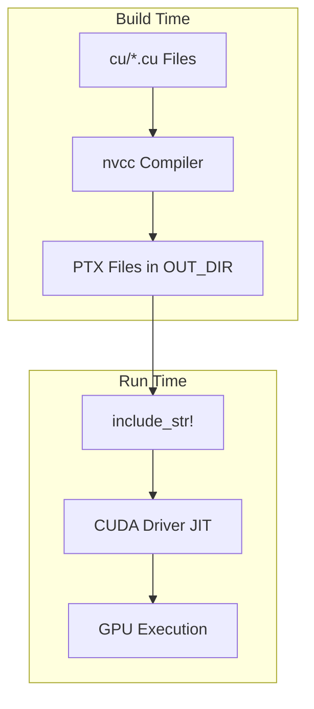
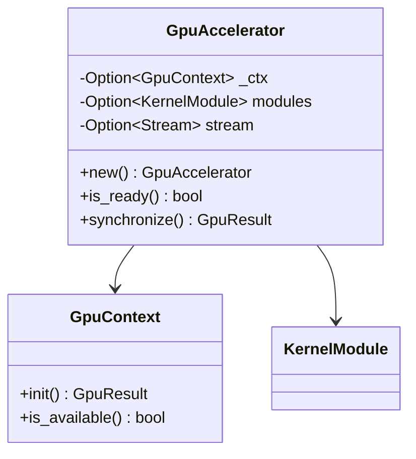
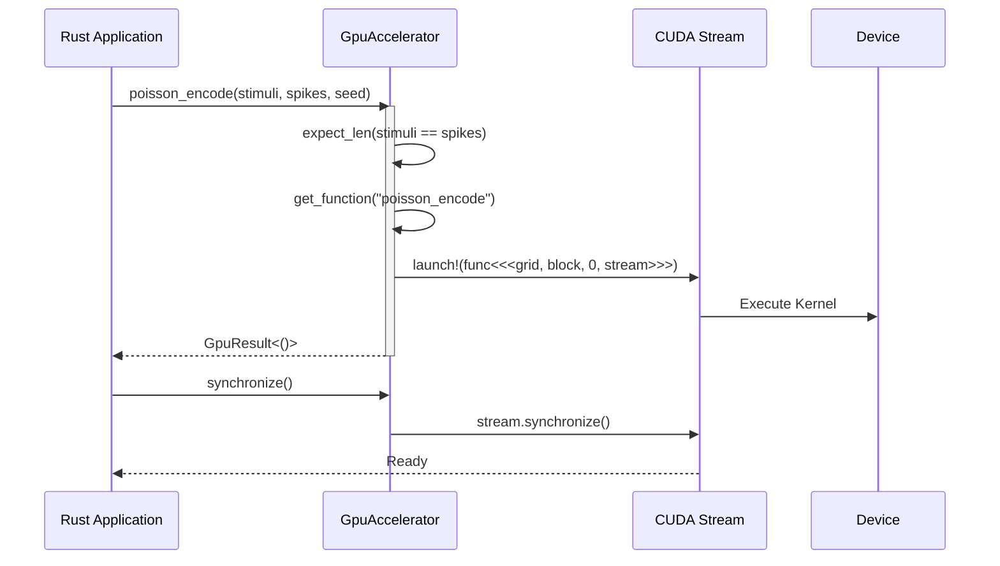

Relevant source files

The following files were used as context for generating this wiki page:

- [src/gpu/kernel.rs](src/gpu/kernel.rs)
- [src/gpu/accelerator.rs](src/gpu/accelerator.rs)
- [src/gpu_stub.rs](src/gpu_stub.rs)
- [build.rs](build.rs)
- [src/lib.rs](src/lib.rs)
- [Cargo.toml](Cargo.toml)
- [README.md](README.md)

# Rust-CUDA FFI Boundary

The Rust-CUDA FFI (Foreign Function Interface) boundary in the `myelin-accelerator` project serves as the bridge between high-level Rust logic and high-performance CUDA kernels. Its primary purpose is to provide a safe, type-safe abstraction over raw CUDA calls, specifically targeting Blackwell-class GPUs (`sm_120`). The boundary handles device initialization, memory management through specialized buffers, and the orchestration of asynchronous kernel launches.

Architecturally, the project employs a dual-path strategy: a real GPU path enabled via the `cuda` feature and a CPU-safe "stub" path for environments lacking NVIDIA hardware. This design ensures that the codebase remains ABI-consistent while allowing developers to compile and test the high-level API without a local CUDA toolkit.
Sources: [README.md:9-25](README.md#L9-L25), [src/lib.rs:5-15](src/lib.rs#L5-L15), [src/gpu_stub.rs:1-15](src/gpu_stub.rs#L1-L15)

## Build System and Feature Gating

The FFI boundary is heavily influenced by Cargo features and the custom build script. The project uses the `cuda` feature to toggle between real hardware interaction and software stubs.

### Feature Flag Matrix

| Feature | Impact on FFI Boundary | Dependencies |
| :--- | :--- | :--- |
| `default` | Uses `gpu_stub.rs`; No `nvcc` required. | `anyhow`, `tracing` |
| `cuda` | Compiles `src/gpu/`; Enables `nvcc` compilation of `.cu` files. | `cust`, `nvtx` |

Sources: [Cargo.toml:16-25](Cargo.toml#L16-L25), [build.rs:37-45](build.rs#L37-L45)

### PTX Generation and Embedding
The build script (`build.rs`) manages the compilation of CUDA source files (`.cu`) into Parallel Thread Execution (PTX) modules. These modules are embedded directly into the Rust binary at compile time using `include_str!`, removing the need for runtime filesystem lookups.

The build system enforces specific ISA requirements, notably a floor of `9.2` for `sm_120` (Blackwell) targets to prevent `InvalidPtx` errors during JIT compilation.
Sources: [build.rs:24-35](build.rs#L24-L35), [build.rs:60-95](build.rs#L60-L95), [src/gpu/kernel.rs:18-27](src/gpu/kernel.rs#L18-L27)

## Core FFI Abstractions

The project encapsulates CUDA's complexity within several core Rust structures that mirror CUDA entities.

### GpuAccelerator and GpuContext
The `GpuAccelerator` is the primary entry point for launching kernels. It manages a `GpuContext`, `KernelModule` (containing JIT-compiled functions), and a CUDA `Stream` for asynchronous operations.

Sources: [src/gpu/accelerator.rs:19-35](src/gpu/accelerator.rs#L19-L35), [src/gpu_stub.rs:41-50](src/gpu_stub.rs#L41-L50)

### Memory Management: GpuBuffer
`GpuBuffer<T>` provides a safe wrapper around device memory. It handles allocation, deallocation (via `Drop`), and data transfers between host and device.

*  **alloc(len):** Allocates memory on the device.
*  **from_slice(data):** Transfers data from host to device during creation.
*  **upload(data):** Updates device memory from a host slice, enforcing length checks.
*  **as_device_ptr():** Provides the raw pointer required for kernel launches.

Sources: [src/gpu/accelerator.rs:296-304](src/gpu/accelerator.rs#L296-L304), [src/gpu_stub.rs:72-105](src/gpu_stub.rs#L72-L105)

## Kernel Management and Launch Logic

Kernel functions are loaded into a `HashMap` within the `KernelModule` and retrieved by their string symbols.

### Kernel Discovery
The project explicitly maps Rust function names to CUDA kernel symbols across different modules like `spiking_network`, `vector_similarity`, and `satsolver`.

| Module | Key Kernel Symbols |
| :--- | :--- |
| **Spiking Network** | `poisson_encode`, `lif_step`, `stdp_update` |
| **Vector Similarity** | `cosine_similarity_batched`, `cosine_similarity_top_k` |
| **SAT Solver** | `satsolver_step`, `satsolver_aux_update`, `satsolver_extract` |

Sources: [src/gpu/kernel.rs:46-95](src/gpu/kernel.rs#L46-L95)

### Execution Flow
Kernel launches follow a strict sequence of length validation, parameter preparation, and asynchronous dispatch via the `cust::launch!` macro.

Sources: [src/gpu/accelerator.rs:271-294](src/gpu/accelerator.rs#L271-L294), [src/gpu/accelerator.rs:65-70](src/gpu/accelerator.rs#L65-L70)

## Profiling and Instrumentation
When the `cuda` feature is active, the FFI boundary integrates with `nvtx` to provide markers for Nsight Systems and Nsight Compute. Significant operations like `KernelModule::load` are wrapped in `range_push!` and `range_pop!` to identify JIT compilation overhead in profiling timelines.
Sources: [src/gpu/kernel.rs:16](src/gpu/kernel.rs#L16), [src/gpu/kernel.rs:40-44](src/gpu/kernel.rs#L40-L44), [Cargo.toml:24](Cargo.toml#L24)

## Summary
The Rust-CUDA FFI boundary in `myelin-accelerator` provides a robust, feature-gated interface for GPU acceleration. By leveraging `build.rs` for PTX management, `cust` for resource handling, and `GpuBuffer` for memory safety, it allows the project to execute neuromorphic and SAT search workloads on Blackwell hardware while maintaining a safe and ergonomic Rust API.
