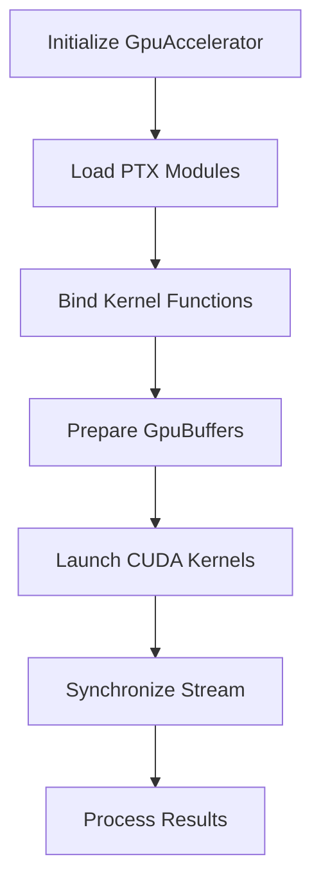
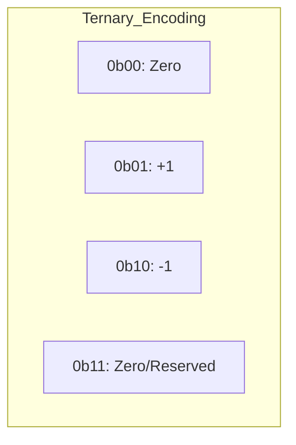
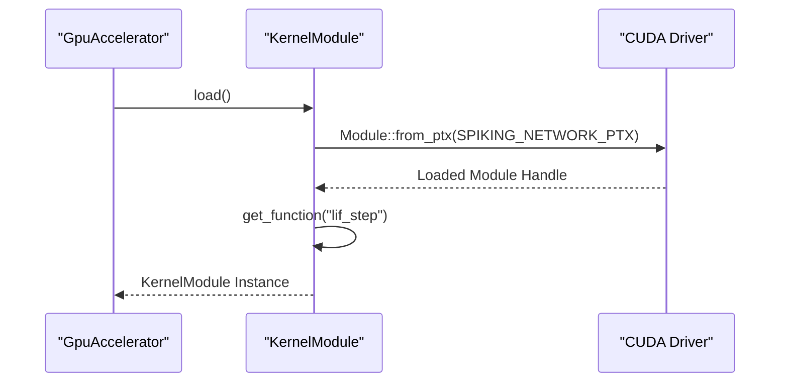

<details>
<summary>Relevant source files</summary>

The following files were used as context for generating this wiki page:

- [README.md](README.md)
- [src/gpu/accelerator.rs](src/gpu/accelerator.rs)
- [src/gpu/kernel.rs](src/gpu/kernel.rs)
- [src/bitpacking.rs](src/bitpacking.rs)
- [build.rs](build.rs)
- [examples/benchmark.rs](examples/benchmark.rs)
- [src/gpu_stub.rs](src/gpu_stub.rs)
</details>

# Spiking Network Inference

Spiking Network Inference in the `myelin-accelerator` project represents the low-level compute layer designed for neuromorphic simulation. It utilizes high-performance CUDA kernels specifically tuned for Blackwell-class (RTX 5080) hardware to handle the parallel processing requirements of spiking neural networks (SNNs). The system is exposed to the rest of the stack through safe Rust FFI wrappers, providing a unified interface for GPU-accelerated operations.

The inference engine covers several critical phases of SNN execution, including stimuli encoding (e.g., Poisson encoding), Leaky Integrate-and-Fire (LIF) neuron simulations, and synaptic plasticity updates (STDP). It operates under a strict memory discipline, maintaining static kernel footprints to ensure efficiency on 16 GB VRAM hardware.

Sources: [README.md:1-12](README.md#L1-L12), [src/gpu/kernel.rs:25-45](src/gpu/kernel.rs#L25-L45)

## Architecture and Components

The architecture is divided into a high-level Rust interface (`GpuAccelerator`) and a low-level CUDA implementation. The system is designed to be "Blackwell-first," targeting `sm_120` compute capability while providing a "CPU-safe" stub path for environments without CUDA hardware.

### System Flow Overview

The following diagram illustrates the lifecycle of a spiking network inference task, from module loading to kernel execution.



The `GpuAccelerator` manages the `GpuContext`, PTX `KernelModule`, and a CUDA `Stream` to keep the GPU busy without serializing work through a single host thread.
Sources: [src/gpu/accelerator.rs:24-60](src/gpu/accelerator.rs#L24-L60), [src/gpu/kernel.rs:40-50](src/gpu/kernel.rs#L40-L50)

### Core Components Table

| Component | Description | File Path |
|:---|:---|:---|
| `GpuAccelerator` | Primary entry point for launching GPU kernels and managing execution streams. | `src/gpu/accelerator.rs` |
| `KernelModule` | Manages JIT-compiled PTX modules and provides function handles for specific kernels. | `src/gpu/kernel.rs` |
| `GpuBuffer` | Handles allocation and data transfer between Host and Device memory. | `src/gpu_stub.rs` / `src/gpu/memory.rs` |
| `spiking_network.cu` | Contains device-side logic for LIF steps, Poisson encoding, and STDP updates. | `cu/spiking_network.cu` |

Sources: [README.md:32-45](README.md#L32-L45), [src/gpu/accelerator.rs:16-22](src/gpu/accelerator.rs#L16-L22)

## Neuron Simulation and Encoding

A critical part of the inference process is converting continuous input into discrete spikes and simulating neuron state transitions over time.

### Poisson Encoding
The `poisson_encode` kernel transforms input stimuli (activation levels) into spike events based on a stochastic process. It takes a buffer of stimuli and a seed to generate unique spike patterns across the network.

```rust
pub fn poisson_encode(
    &self,
    stimuli: &GpuBuffer<f32>,
    spikes: &mut GpuBuffer<u32>,
    seed: u32,
) -> GpuResult<()> {
    self.poisson_encode_async(stimuli, spikes, seed)?;
    self.synchronize()
}
```

Sources: [src/gpu/accelerator.rs:253-261](src/gpu/accelerator.rs#L253-L261), [examples/benchmark.rs:434-445](examples/benchmark.rs#L434-L445)

### Spiking Network Kernels
The system loads several specialized functions for SNN simulation from the `spiking_network` PTX module:
*  `lif_step` / `lif_step_weighted`: Performs the Leaky Integrate-and-Fire state update.
*  `stdp_update`: Handles Spike-Timing-Dependent Plasticity synaptic weight adjustments.
*  `spike_rate`: Calculates the firing frequency of neurons.
*  `latent_reduce_pass2`: Parallel reduction for network-level latent variables.

Sources: [src/gpu/kernel.rs:48-59](src/gpu/kernel.rs#L48-L59)

## Data Representation and Bitpacking

To maximize throughput and minimize memory bandwidth usage, the system employs host-side bitpacking for binary and ternary values. This is essential for SNNs where synaptic weights or neuron states are often low-precision.

### Bitpacking Layouts
1.  **Binary (1-bit)**: 32 values per `u32` word.
2.  **Ternary (2-bit)**: 16 values per `u32` word, supporting values `{-1, 0, +1}`.



Sources: [src/bitpacking.rs:11-28](src/bitpacking.rs#L11-L28), [src/bitpacking.rs:88-95](src/bitpacking.rs#L88-L95)

### Bitpacking Interface

| Function | Role | Packing Density |
|:---|:---|:---|
| `pack_binary` | Packs `bool` to `u32` | 32 values/word |
| `pack_ternary` | Packs `i8` (`{-1, 0, 1}`) to `u32` | 16 values/word |
| `unpack_binary` | Recovers `bool` from `u32` | N/A |
| `unpack_ternary` | Recovers `i8` from `u32` | N/A |

Sources: [src/bitpacking.rs:40-100](src/bitpacking.rs#L40-L100)

## Compilation and Hardware Targeting

The inference engine is specifically built for NVIDIA Blackwell architectures (`sm_120`). The build process uses `nvcc` to generate PTX files that are embedded into the Rust binary at compile time.

### PTX Versioning Requirements
Blackwell hardware requires a minimum PTX ISA version of 9.0. The `build.rs` script ensures that any compiled kernels meet this floor, clamping overrides to `9.2` for `sm_120` targets to prevent `InvalidPtx` errors at JIT-load time.

```rust
// build.rs logic for sm_120 targeting
const DEFAULT_REAL_PTX_VERSION: &str = "9.2";
let is_blackwell = arch.starts_with("sm_12") || arch.starts_with("compute_12");
if is_blackwell {
    ensure_min_ptx_version(&output, DEFAULT_REAL_PTX_VERSION);
}
```

Sources: [build.rs:11-15](build.rs#L11-L15), [build.rs:72-85](build.rs#L72-L85), [REVIEW.md:200-210](REVIEW.md#L200-L210)

### Module Loading Sequence
The `KernelModule` loads PTX strings via `include_str!` and JIT-compiles them using the CUDA driver.



Sources: [src/gpu/kernel.rs:40-75](src/gpu/kernel.rs#L40-L75), [src/gpu/kernel.rs:125-135](src/gpu/kernel.rs#L125-L135)

## Conclusion

Spiking Network Inference in this repository is characterized by its "Blackwell-first" optimization, static memory footprint, and efficient parallel reduction paths. By combining dedicated CUDA kernels for lif-steps and Poisson encoding with host-side bitpacking utilities, the system provides a high-throughput foundation for neuromorphic workloads on modern GPU hardware.
