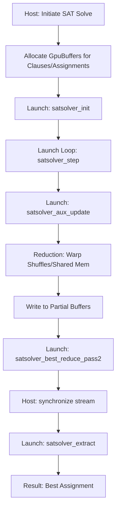
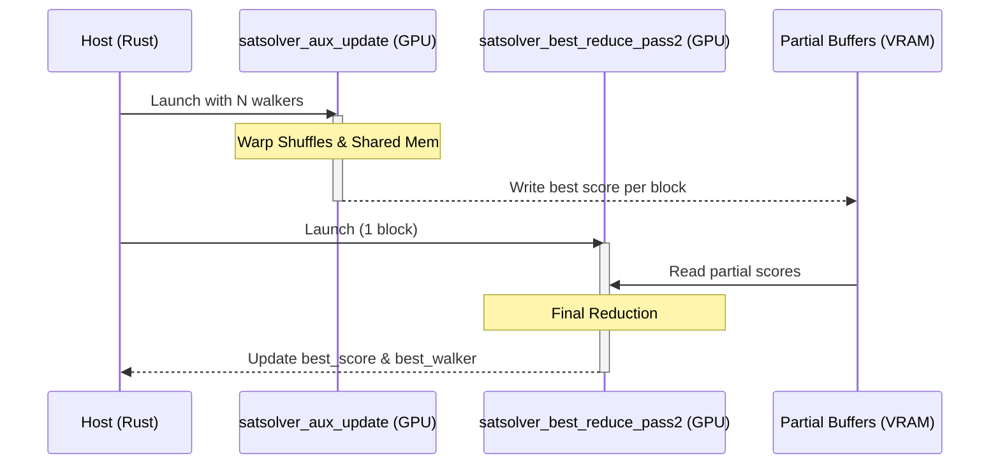

Relevant source files

The following files were used as context for generating this wiki page:

- [README.md](README.md)
- [src/gpu/kernel.rs](src/gpu/kernel.rs)
- [src/gpu/accelerator.rs](src/gpu/accelerator.rs)
- [src/bitpacking.rs](src/bitpacking.rs)
- [build.rs](build.rs)
- [examples/benchmark.rs](examples/benchmark.rs)
- [REVIEW.md](REVIEW.md)

# SAT Solver Kernel

## Introduction
The **SAT Solver Kernel** is a high-performance CUDA implementation designed for Boolean satisfiability (SAT) search workloads. It is optimized for NVIDIA Blackwell (RTX 5080-class) hardware, specifically targeting the `sm_120` architecture. The solver is part of the `myelin-accelerator` low-level compute layer, which provides safe Rust FFI wrappers for GPU-accelerated neuromorphic and search tasks.

The kernel's primary objective is to execute SAT walks in parallel across multiple "walkers" on the GPU. Significant optimizations include the removal of `atomicMin` from hot reduction paths, replacing global serialization with warp shuffles and shared memory reductions to improve SM occupancy and throughput.

Sources: [README.md:3-8](README.md#L3-L8), [README.md:21-23](README.md#L21-L23), [src/gpu/kernel.rs:13-17](src/gpu/kernel.rs#L13-L17)

## Architecture and Components

The SAT Solver is implemented as a set of PTX modules compiled from `cu/satsolver.cu`. These modules are managed by the `KernelModule` struct, which handles JIT-compilation via the CUDA driver and maintains handles to specific kernel functions.

### Kernel Functions
The following table describes the primary functions exposed by the SAT Solver kernel module:

| Function Name | Description |
|:--- |:--- |
| `satsolver_init` | Initializes the solver state. |
| `satsolver_step` | Executes a single step of the SAT search algorithm. |
| `satsolver_aux_update` | Updates auxiliary state (e.g., sat_flags) and performs initial score reduction. |
| `satsolver_check_solution` | Validates if the current assignment satisfies the clauses. |
| `satsolver_extract` | Extracts the final variable assignments for the best walker. |
| `satsolver_best_reduce_pass1` | First pass of the parallel reduction to find the best score/walker. |
| `satsolver_best_reduce_pass2` | Second pass of the reduction to finalize the best global result. |

Sources: [src/gpu/kernel.rs:75-83](src/gpu/kernel.rs#L75-L83), [src/gpu/accelerator.rs:125-132](src/gpu/accelerator.rs#L125-L132)

### System Flow
The interaction between the host (Rust) and the device (CUDA) involves managing asynchronous launches and partial result buffers.

The diagram shows the parallel reduction flow where `satsolver_aux_update` writes partial results before a final pass reduces them to a single best score. 
Sources: [src/gpu/accelerator.rs:163-228](src/gpu/accelerator.rs#L163-L228), [README.md:52-54](README.md#L52-L54)

## Data Management and Memory Structures

The SAT Solver utilizes `GpuBuffer<T>` for data transfer and management. For large-scale search, it uses auxiliary buffers to store partial scores and walker indices during multi-pass reductions.

### Memory Allocation Strategy
*  **Static Footprint**: Kernel footprints are kept static and bounded within 16 GB VRAM limits to ensure stability on RTX 5080 hardware.
*  **Auxiliary Buffers**: `GpuAccelerator` maintains `aux_partial_scores` and `aux_partial_walkers` as `RefCell<Option<GpuBuffer<i32>>>`. These are lazily reallocated only if the current grid size exceeds the existing buffer capacity.

Sources: [README.md:18-20](README.md#L18-L20), [src/gpu/accelerator.rs:20-25](src/gpu/accelerator.rs#L20-L25), [src/gpu/accelerator.rs:194-207](src/gpu/accelerator.rs#L194-L207)

### Multi-Pass Reduction Logic
The solver avoids global atomics by using a two-pass reduction strategy for finding the best walker score.

The sequence illustrates how the host coordinates two distinct kernel launches to perform a complete reduction without atomic contention.
Sources: [src/gpu/accelerator.rs:210-228](src/gpu/accelerator.rs#L210-L228), [README.md:52-54](README.md#L52-L54)

## Host Bitpacking Integration
While the GPU handles the search, the host performs binary and ternary bitpacking of variable assignments to optimize memory transfer and storage. 

*  **Binary Packing**: Packs 32 `bool` values into a single `u32` word.
*  **Ternary Packing**: Packs 16 values (`-1, 0, 1`) into a `u32` word using a 2-bit encoding:
  *  `0b00` / `0b11`: 0
  *  `0b01`: +1
  *  `0b10`: -1

Sources: [src/bitpacking.rs:16-24](src/bitpacking.rs#L16-L24), [src/bitpacking.rs:77-85](src/bitpacking.rs#L77-L85)

## Build and Compilation Specs
The SAT Solver kernel is compiled to PTX using `nvcc` with specific flags to ensure compatibility with modern C++ and the Blackwell architecture.

| Parameter | Value / Flag |
|:--- |:--- |
| **CUDA Arch** | `sm_120` |
| **PTX Version** | `9.2` (minimum for Blackwell) |
| **Host Standard** | `-std=c++17` |
| **Optimization** | `-O3`, `--use_fast_math` |
| **Compatibility** | `--allow-unsupported-compiler` |

Sources: [build.rs:11-14](build.rs#L11-L14), [build.rs:159-170](build.rs#L159-L170), [CMakeLists.txt:12-24](CMakeLists.txt#L12-L24)

## Summary
The SAT Solver Kernel provides a high-throughput parallel search engine optimized for Blackwell GPUs. By utilizing multi-pass reductions and avoiding global atomics, it maximizes SM occupancy. The integration with Rust via `GpuAccelerator` ensures safe buffer management and efficient asynchronous execution, while host-side bitpacking minimizes the data footprint.

Sources: [README.md:57-61](README.md#L57-L61), [src/gpu/accelerator.rs:145-161](src/gpu/accelerator.rs#L145-L161)
