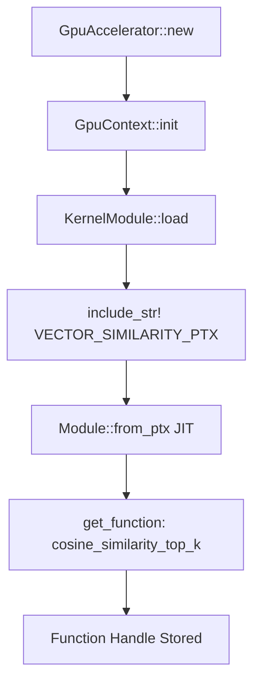
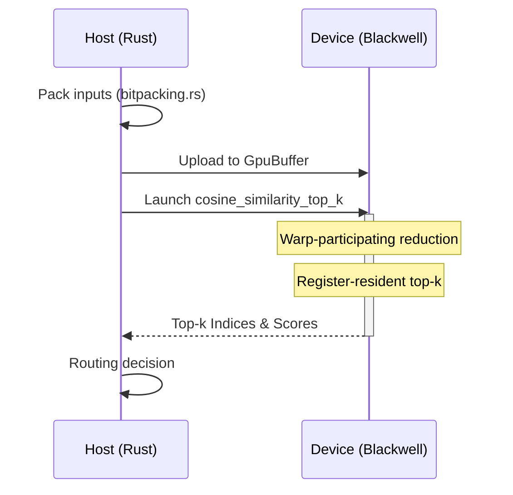

Relevant source files

The following files were used as context for generating this wiki page:

- [README.md](README.md)
- [src/gpu/kernel.rs](src/gpu/kernel.rs)
- [src/gpu/accelerator.rs](src/gpu/accelerator.rs)
- [src/gpu_stub.rs](src/gpu_stub.rs)
- [src/bitpacking.rs](src/bitpacking.rs)
- [examples/benchmark.rs](examples/benchmark.rs)
- [build.rs](build.rs)

# Vector Similarity & MoE Routing

Vector Similarity Search and Mixture-of-Experts (MoE) Routing are core components of the `myelin-accelerator` crate, designed to handle high-performance routing workloads on Blackwell-class GPUs (`sm_120`). These features provide the low-level compute kernels necessary for efficient vector comparisons and top-k selection, which are critical for neuromorphic inference and sparse neural network architectures.

The implementation focuses on eliminating traditional GPU bottlenecks, such as single-threaded selection tails, by utilizing warp-participating reductions and block-local merge stages. This ensures high Streaming Multiprocessor (SM) occupancy and low latency for routing-heavy tasks.

Sources: [README.md:3-8](README.md#L3-L8), [README.md:73-77](README.md#L73-L77)

## Architecture and Components

The system is structured as a Rust FFI wrapper around specialized CUDA kernels. The architecture separates the host-side management (buffer allocation, kernel launching) from the device-side execution (vector similarity math).

### Core Components Table

| Component | Role | File Path |
|-----------|------|-----------|
| `vector_similarity.cu` | Device kernels for cosine similarity and top-k selection. | `cu/vector_similarity.cu` |
| `KernelModule` | Manages PTX module loading and function handle retrieval. | `src/gpu/kernel.rs` |
| `GpuAccelerator` | High-level interface for launching GPU tasks. | `src/gpu/accelerator.rs` |
| `GpuBuffer` | Safe wrapper for GPU memory allocation and data transfer. | `src/gpu/memory.rs` |
| `bitpacking` | Host-side utilities for binary/ternary vector compression. | `src/bitpacking.rs` |

Sources: [README.md:27-40](README.md#L27-L40), [src/gpu/kernel.rs:25-30](src/gpu/kernel.rs#L25-L30), [src/gpu/accelerator.rs:18-24](src/gpu/accelerator.rs#L18-L24)

### Kernel Loading Flow
The following diagram illustrates how the vector similarity kernels are loaded and managed within the GPU context.

The `KernelModule` uses `include_str!` to embed PTX at compile time, which is then JIT-compiled by the CUDA driver on the first call.
Sources: [src/gpu/kernel.rs:36-50](src/gpu/kernel.rs#L36-L50), [src/gpu/kernel.rs:69-77](src/gpu/kernel.rs#L69-L77)

## Vector Similarity Implementation

The accelerator provides kernels specifically tuned for Blackwell hardware to perform vector comparisons. The primary focus is on `cosine_similarity_top_k`, which has been optimized to move away from serial selection methods.

### Optimization Strategies
*  **Warp-Participating Reduction:** Instead of a single-thread selection tail, the kernel uses parallel top-k reduction across the warp.
*  **Register-Resident Candidates:** Candidates for top-k are kept in registers to minimize global memory access during the selection process.
*  **Block-Local Merge:** The system utilizes shared memory and warp shuffles to perform merging stages locally within blocks.

Sources: [README.md:14-16](README.md#L14-L16), [README.md:73-77](README.md#L73-L77)

### Kernel Symbols
The `vector_similarity` module exposes the following device symbols:
*  `cosine_similarity_batched`: Computes similarity scores for multiple vectors in parallel.
*  `cosine_similarity_top_k`: Identifies the top $k$ most similar vectors for routing decisions.

Sources: [src/gpu/kernel.rs:82-86](src/gpu/kernel.rs#L82-L86)

## MoE Routing Data Flow

In a Mixture-of-Experts context, routing involves determining which "experts" (represented as vectors) are most relevant to a given input. The `myelin-accelerator` handles this through a combination of bitpacking and similarity search.

This flow minimizes the bottleneck typically found in MoE routing by keeping the selection process parallel on the GPU.
Sources: [README.md:73-77](README.md#L73-L77), [src/gpu/accelerator.rs:48-60](src/gpu/accelerator.rs#L48-L60)

## Bitpacking for Routing Efficiency

To reduce VRAM footprint and increase memory bandwidth efficiency during routing, the accelerator employs binary and ternary bitpacking.

### Packing Schemes
*  **Binary (1-bit):** Packs 32 values into a single `u32`. Bit `i` of word `w` represents element `w * 32 + i`.
*  **Ternary (2-bit):** Packs 16 values into a single `u32`. Encodes `{-1, 0, +1}` using 2 bits per element.

Sources: [src/bitpacking.rs:8-19](src/bitpacking.rs#L8-L19)

### Alignment Requirements
For optimal performance with CUDA vectorized 128-bit loads, the system suggests:
*  **Natural Alignment:** 4-byte (standard `u32`).
*  **Vectorized Alignment:** 16-byte (for 128-bit loads).

Sources: [src/bitpacking.rs:21-23](src/bitpacking.rs#L21-L23)

## Technical Summary

The Vector Similarity & MoE Routing module provides high-throughput, low-latency primitives for routing workloads. By targeting `sm_120` and utilizing warp-level parallelism for top-k selection, it avoids the serialization issues common in earlier routing implementations. The integration of bitpacking further optimizes the data path, making it suitable for large-scale neuromorphic models.

Sources: [README.md:3-8](README.md#L3-L8), [README.md:73-81](README.md#L73-L81)
