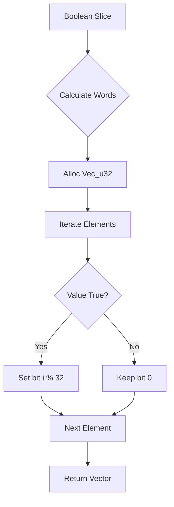
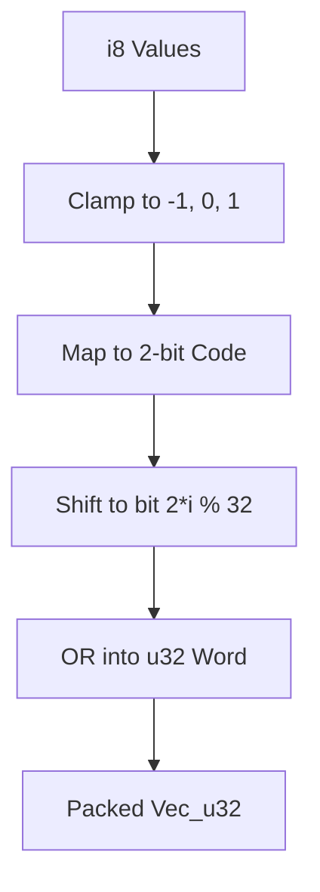

<details>
<summary>Relevant source files</summary>

The following files were used as context for generating this wiki page:

- [src/bitpacking.rs](src/bitpacking.rs)
- [src/lib.rs](src/lib.rs)
- [README.md](README.md)
- [examples/benchmark.rs](examples/benchmark.rs)
- [tests/api_contract.rs](tests/api_contract.rs)
</details>

# Ternary & Binary Bitpacking

## Introduction
Ternary and Binary Bitpacking in the `myelin-accelerator` project provides host-side utilities for compressing sparse or low-precision data into dense `u32` words. This system is essential for neuromorphic inference and GPU workloads where memory bandwidth and storage efficiency are critical. By packing values into bit-dense vectors, the project reduces the footprint of user-managed tensors before they are processed by Blackwell-optimized CUDA kernels.

The bitpacking module lives on the host side (CPU) and serves as the primary data preparation layer. It supports 1-bit binary encoding for boolean states and 2-bit ternary encoding for signed values `{-1, 0, +1}`. These utilities ensure that data is correctly aligned and formatted for the high-performance launch paths utilized by the GPU accelerator.

Sources: [src/bitpacking.rs:1-18](src/bitpacking.rs#L1-L18), [README.md:8-16](README.md#L8-L16), [src/lib.rs:5-6](src/lib.rs#L5-L6)

## Binary Packing (1-bit)
Binary packing compresses boolean values into a bitstream where each `u32` word holds exactly 32 values. A set bit (1) represents `true`, while a clear bit (0) represents `false`. The elements are indexed such that bit `i` of word `w` corresponds to the element at index `w * 32 + i`.

### Logic and Architecture
The binary packing process calculates the required word count using ceiling division by 32. During packing, bits are shifted into position within the `u32` vector. Unpacking reverses this by shifting and masking individual bits, with an optional parameter to truncate the result to a specific element count if the source bits in the final word are padding.



The diagram above illustrates the flow of transforming a sequence of booleans into a dense `u32` bit vector.
Sources: [src/bitpacking.rs:7-11](src/bitpacking.rs#L7-L11), [src/bitpacking.rs:31-60](src/bitpacking.rs#L31-L60)

### Binary Implementation Details
| Constant / Function | Value / Return Type | Description |
|:---|:---|:---|
| `BINARY_VALUES_PER_WORD` | `usize = 32` | Number of boolean values stored in one `u32`. |
| `binary_word_count(n)` | `usize` | Returns `ceil(n / 32)`. |
| `pack_binary(values)` | `Vec<u32>` | Packs `&[bool]` into dense bit vector. |
| `unpack_binary(packed, count)`| `Vec<bool>` | Unpacks `u32` bits into booleans. |

Sources: [src/bitpacking.rs:21-50](src/bitpacking.rs#L21-L50)

## Ternary Packing (2-bit)
Ternary packing handles signed values in the set `{-1, 0, +1}`. Each `u32` word stores 16 ternary values using 2 bits per element. This provides a dense representation for weights or activations in quantized neural networks.

### Encoding Scheme
The system uses a specific 2-bit mapping for ternary values. Values outside the standard ternary set are clamped during the packing process:
*  `0` is encoded as `0b00`
*  `+1` (and above) is encoded as `0b01`
*  `-1` (and below) is encoded as `0b10`
*  `0b11` is a reserved state that decodes to `0`

Sources: [src/bitpacking.rs:13-18](src/bitpacking.rs#L13-L18), [src/bitpacking.rs:77-85](src/bitpacking.rs#L77-L85)

### Ternary Data Flow



This diagram shows the transformation of `i8` integers into a 2-bit ternary representation within 32-bit words.
Sources: [src/bitpacking.rs:71-105](src/bitpacking.rs#L71-L105)

### Ternary Implementation Details
| Constant / Function | Value / Return Type | Description |
|:---|:---|:---|
| `TERNARY_VALUES_PER_WORD` | `usize = 16` | Number of ternary values in one `u32`. |
| `ternary_word_count(n)` | `usize` | Returns `ceil(n / 16)`. |
| `pack_ternary(values)` | `Vec<u32>` | Packs `&[i8]` into 2-bit encoding. |
| `unpack_ternary(packed, count)`| `Vec<i8>` | Unpacks 2-bit codes into signed `i8`. |

Sources: [src/bitpacking.rs:24-118](src/bitpacking.rs#L24-L118)

## Alignment and Performance
Packed buffers are naturally 4-byte aligned as they consist of `u32` integers. However, for optimal performance with CUDA vectorized 128-bit loads (relevant for the GPU accelerator's kernels), the system suggests ensuring 16-byte alignment of the underlying buffers.

The performance of these operations is tracked via a benchmark harness that measures throughput in operations per second and latency in microseconds. The `benchmark.rs` example includes dedicated suites for both binary and ternary packing/unpacking at varying scales (e.g., 256 vs 65536 elements).

```rust
// Example from src/bitpacking.rs:77-85
pub fn pack_ternary(values: &[i8]) -> Vec<u32> {
    let word_count = ternary_word_count(values.len());
    let mut out = vec![0u32; word_count];
    for (i, &v) in values.iter().enumerate() {
        let code: u32 = match v {
            0 => 0b00,
            1..=i8::MAX => 0b01,  // +1 clamped
            i8::MIN..=-1 => 0b10, // -1 clamped
        };
        // ... bit shifting logic
    }
    out
}
```

Sources: [src/bitpacking.rs:20-22](src/bitpacking.rs#L20-L22), [examples/benchmark.rs:205-270](examples/benchmark.rs#L205-L270), [src/bitpacking.rs:77-85](src/bitpacking.rs#L77-L85)

## Integration and Testing
The bitpacking module is re-exported at the crate root for ergonomic access. It is used alongside the `GpuAccelerator` to prepare data before it is uploaded to `GpuBuffer` objects.

### Validation Contract
The project maintains a rigorous testing suite including:
1.  **Roundtrip Tests:** Ensuring `unpack(pack(x)) == x` for both binary and ternary types.
2.  **Property-based Testing:** Using `proptest` to validate packing logic across a wide range of random input vectors.
3.  **Clamping Verification:** Confirming that values outside `{-1, 0, 1}` are handled gracefully.
4.  **API Contracts:** Integration tests that verify the public symbols are correctly exported and functional.

Sources: [src/lib.rs:11-18](src/lib.rs#L11-L18), [tests/api_contract.rs:12-38](tests/api_contract.rs#L12-L38), [src/bitpacking.rs:218-258](src/bitpacking.rs#L218-L258)

## Summary
The Ternary & Binary Bitpacking module provides the necessary host-side infrastructure to support low-precision data formats used in neuromorphic computing. By providing efficient 1-bit and 2-bit compression into `u32` vectors, it enables the system to maximize memory efficiency and prepare data for the high-speed CUDA kernels specialized for Blackwell hardware.
