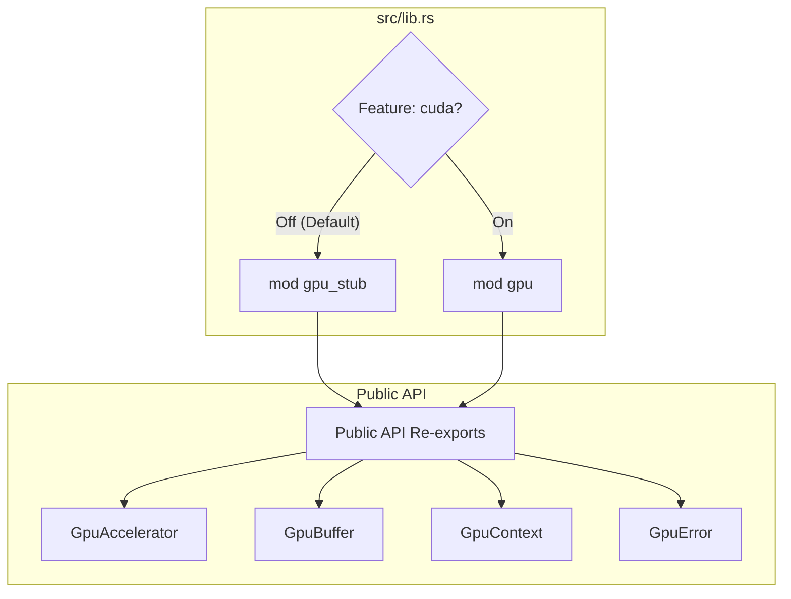

<details>
<summary>Relevant source files</summary>

The following files were used as context for generating this wiki page:

- [src/gpu_stub.rs](src/gpu_stub.rs)
- [src/lib.rs](src/lib.rs)
- [CLAUDE.md](CLAUDE.md)
- [README.md](README.md)
- [tests/api_contract.rs](tests/api_contract.rs)
- [build.rs](build.rs)

</details>

# CPU-Safe Stub API

The CPU-Safe Stub API is a fallback mechanism within the `myelin-accelerator` crate that allows the project to be compiled, tested, and linked in environments lacking a CUDA toolkit or NVIDIA GPU. It provides a mirror of the GPU-accelerated API, ensuring that higher-level orchestration code remains ABI-consistent regardless of whether the `cuda` feature is enabled.

When the `cuda` feature is disabled (the default state), the crate uses `src/gpu_stub.rs` to provide stand-in implementations for key GPU structures such as `GpuAccelerator`, `GpuBuffer`, and `GpuContext`. This path is specifically intended for use in Continuous Integration (CI) pipelines, sandboxed environments, and local development where Blackwell-class hardware is unavailable.

Sources: [CLAUDE.md:20-22](CLAUDE.md#L20-L22), [README.md:32-34](README.md#L32-L34)

## Architecture and Feature Gating

The stub API is managed through Rust's conditional compilation. The `src/lib.rs` file acts as a dispatcher, re-exporting symbols from either the real `gpu` module or the `gpu_stub` module based on the `cuda` feature flag.



*The diagram above illustrates how the project switches between the real GPU implementation and the stub API at the library root.*

Sources: [src/lib.rs:7-17](src/lib.rs#L7-L17)

### Build System Integration
The `build.rs` script supports this architecture by detecting the absence of the `cuda` feature. When the feature is off, it writes "stub" PTX files to the `OUT_DIR`. These stubs contain a minimal header (`.version 8.5`, `.target sm_80`) to satisfy compile-time requirements without invoking `nvcc`.

Sources: [build.rs:11-13](build.rs#L11-L13), [build.rs:37-41](build.rs#L37-L41)

## Core Stub Components

The stub implementation mimics the signature of the real CUDA-based API but returns errors or default values upon interaction.

### GpuContext and KernelModule
In the stub path, `GpuContext::init()` and `KernelModule::load()` always return `GpuError::NoGpu`. This ensures that any attempt to initialize hardware or load kernels fails gracefully with a descriptive error.

| Component | Stub Behavior | Source |
| :--- | :--- | :--- |
| `GpuContext::is_available()` | Always returns `false`. | [src/gpu_stub.rs:44](src/gpu_stub.rs#L44) |
| `GpuContext::init()` | Returns `Err(GpuError::NoGpu)`. | [src/gpu_stub.rs:41](src/gpu_stub.rs#L41) |
| `KernelModule::load()` | Returns `Err(GpuError::NoGpu)`. | [src/gpu_stub.rs:55](src/gpu_stub.rs#L55) |
| `KernelModule::get_function()` | Returns `Err(GpuError::NoGpu)`. | [src/gpu_stub.rs:61](src/gpu_stub.rs#L61) |

### GpuBuffer Implementation
Unlike the accelerator, `GpuBuffer<T>` in the stub API is functional but backed by host memory (`Vec<T>`). This allows integration tests to perform data roundtrips (alloc, upload, and download) without a GPU, simulating memory management logic.

```mermaid
sequenceDiagram
    participant App as Application Code
    participant Buf as GpuBuffer (Stub)
    participant Vec as Host Vector
    
    App->>Buf: alloc(len)
    Buf->>Vec: vec![Default; len]
    App->>Buf: upload(&data)
    Buf->>Vec: clone_from_slice(&data)
    App->>Buf: to_vec()
    Vec-->>App: returns clone of Vec<T>
```

*This sequence shows how the GpuBuffer stub simulates GPU memory operations using standard CPU memory.*

Sources: [src/gpu_stub.rs:68-100](src/gpu_stub.rs#L68-L100)

## Error Handling

The `GpuError` enum provides consistent error variants that match the real CUDA backend's failure modes. In the stub API, the `NoGpu` variant is the primary error returned for hardware-bound operations.

| Variant | Display Message (Stub) |
| :--- | :--- |
| `NoGpu` | "No GPU available (built without `cuda` feature)" |
| `InitFailed(s)` | "GPU init failed: {s}" |
| `ModuleLoadFailed(s)` | "PTX module load failed: {s}" |
| `MemoryError(s)` | "GPU memory error: {s}" |

Sources: [src/gpu_stub.rs:9-32](src/gpu_stub.rs#L9-L32)

## API Contract and Testing

The `tests/api_contract.rs` file contains a dedicated module `stub_contract` that validates the behavior of the stub API. These tests are gated with `#[cfg(not(feature = "cuda"))]` to ensure they only run against the CPU-safe path.

### Verified Behaviors
1.  **Graceful Failure:** `GpuAccelerator` methods like `satsolver_extract` and `poisson_encode` return `Err(GpuError::NoGpu)` immediately.
2.  **Memory Simulation:** `GpuBuffer` permits allocation and `upload` operations, verifying that length mismatches correctly trigger `GpuError::MemoryError`.
3.  **Construction:** `GpuAccelerator::new()` succeeds but `is_ready()` returns `false`.

Sources: [tests/api_contract.rs:42-120](tests/api_contract.rs#L42-L120)

## Summary

The CPU-Safe Stub API provides a robust fallback for the `myelin-accelerator` project, allowing developers to build and test the software in environments without NVIDIA hardware. By providing a host-backed `GpuBuffer` and error-returning stand-ins for hardware controllers, it maintains API compatibility while explicitly signaling the absence of GPU acceleration at runtime.
