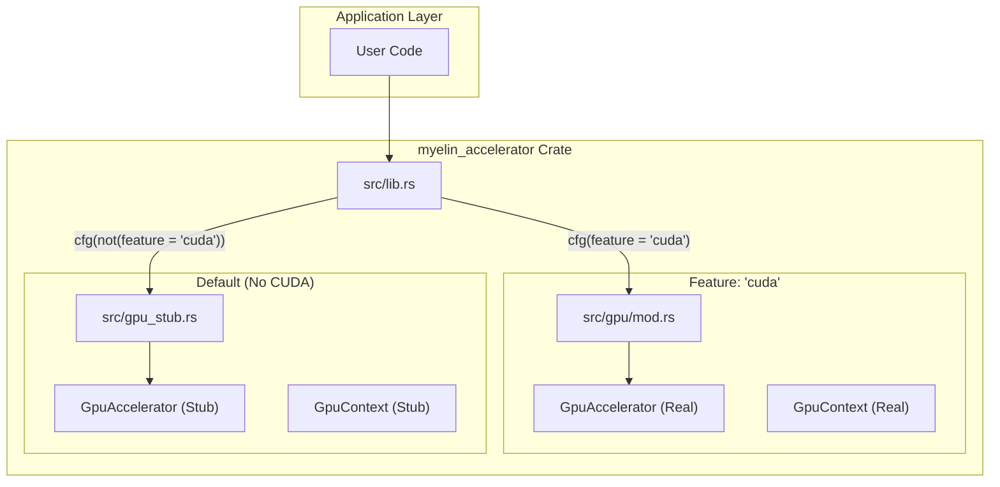
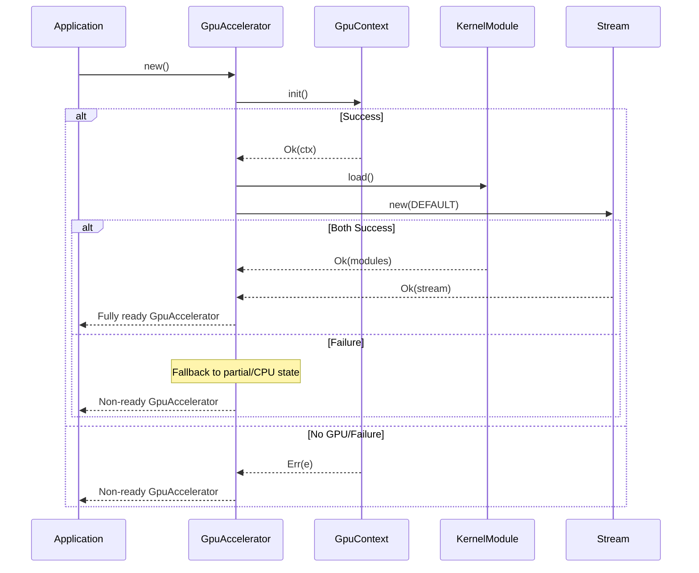

<details>
<summary>Relevant source files</summary>

The following files were used as context for generating this wiki page:

- [src/gpu/accelerator.rs](src/gpu/accelerator.rs)
- [src/gpu/context.rs](src/gpu/context.rs)
- [src/gpu/kernel.rs](src/gpu/kernel.rs)
- [src/gpu/mod.rs](src/gpu/mod.rs)
- [src/gpu_stub.rs](src/gpu_stub.rs)
- [src/lib.rs](src/lib.rs)
- [README.md](README.md)
</details>

# GPU Accelerator & Context

The **GPU Accelerator & Context** system serves as the primary abstraction layer for Blackwell-first CUDA compute operations within the Myelin-Accelerator project. It manages the lifecycle of the CUDA driver environment, JIT-compilation of PTX kernels, and the dispatch of neuromorphic workloads, SAT search, and routing-heavy GPU operations. The system is designed with a "dual-path" architecture: it provides high-performance CUDA execution when the `cuda` feature is enabled and falls back to a safe, non-functional stub (CPU-safe) implementation when the feature is disabled.

This module is the low-level compute layer responsible for keeping the GPU busy by preventing work serialization through single threads. It specifically targets RTX 5080-class hardware (`sm_120`) while maintaining a strict memory discipline for VRAM usage. Key components include context management for device initialization and the accelerator for managing asynchronous streams and kernel launches.

Sources: [README.md:3-12](README.md#L3-L12), [src/lib.rs:8-18](src/lib.rs#L8-L18), [src/gpu/accelerator.rs:24-60](src/gpu/accelerator.rs#L24-L60)

## Architecture Overview

The system architecture is divided between environment management (`GpuContext`), kernel management (`KernelModule`), and execution orchestration (`GpuAccelerator`).

### Dual-Path Implementation
The project uses Rust's conditional compilation to switch between real GPU bindings and CPU-safe stubs. This allows the codebase to remain ABI-consistent and compile in environments without a CUDA toolkit or compatible hardware.



*The diagram above illustrates how the project selects either the real GPU implementation or the stub based on the `cuda` feature flag.*
Sources: [src/lib.rs:8-18](src/lib.rs#L8-L18), [src/gpu_stub.rs:41-48](src/gpu_stub.rs#L41-L48), [src/gpu/mod.rs:10-16](src/gpu/mod.rs#L10-L16)

## GPU Context Management

The `GpuContext` is responsible for initializing the CUDA driver and establishing the primary execution environment. When the `cuda` feature is enabled, it uses the `cust` crate to wrap the CUDA Driver API.

*  **Initialization:** The `init()` method handles the idempotent initialization of the CUDA driver.
*  **Availability Checks:** The `is_available()` method allows higher-level logic to determine if hardware acceleration is possible before attempting buffer allocations or kernel launches.

Sources: [src/gpu/context.rs](src/gpu/context.rs), [src/gpu_stub.rs:41-48](src/gpu_stub.rs#L41-L48)

## GPU Accelerator

The `GpuAccelerator` is the main entry point for executing kernels. It encapsulates the GPU context, loaded PTX modules, and a CUDA stream for asynchronous execution.

### Key Components

| Component | Description |
| :--- | :--- |
| `_ctx` | The initialized `GpuContext` owning the CUDA driver handle. |
| `modules` | A `KernelModule` instance containing JIT-compiled PTX kernels. |
| `stream` | A `cust::stream::Stream` for non-blocking GPU operations. |
| `aux_partial_scores` | RefCell-wrapped `GpuBuffer` for intermediate SAT solver reduction results. |
| `aux_partial_walkers` | RefCell-wrapped `GpuBuffer` for intermediate SAT solver walker indices. |

Sources: [src/gpu/accelerator.rs:17-23](src/gpu/accelerator.rs#L17-L23)

### Initialization Flow

The `GpuAccelerator::new()` function attempts to initialize the full GPU stack. If any stage (Context, Kernel loading, or Stream creation) fails, it emits a warning via `tracing` and falls back to a state where `is_ready()` returns `false`, effectively disabling GPU acceleration for that instance.



*Sequence of initialization steps during GpuAccelerator construction.*
Sources: [src/gpu/accelerator.rs:25-60](src/gpu/accelerator.rs#L25-L60)

## Kernel Execution & Dispatch

The accelerator provides high-level Rust wrappers for specific CUDA kernels. These wrappers handle parameter validation, grid/block dimension calculation, and asynchronous launch.

### Supported Operations

1.  **Poisson Encoding:** Converts stimuli (f32) into spike trains (u32).
  *  *Kernel:* `poisson_encode`
  *  *Architecture:* 256-thread blocks, grid size derived from input length.
2.  **SAT Solver Extraction:** Extracts the best assignment from a SAT solver walker grid.
  *  *Kernel:* `satsolver_extract`
  *  *Params:* `n_vars`, `n_walkers`.
3.  **SAT Solver Aux Reduction:** A two-pass reduction system for finding the best score among walkers without global atomic serialization.
  *  *Kernels:* `satsolver_aux_update` (Pass 1) and `satsolver_best_reduce_pass2` (Pass 2).

Sources: [src/gpu/accelerator.rs:77-118](src/gpu/accelerator.rs#L77-L118), [src/gpu/accelerator.rs:193-228](src/gpu/accelerator.rs#L193-L228), [README.md:14-25](README.md#L14-L25)

### Asynchronous vs Synchronous Execution
Most operations have an `_async` variant that returns immediately after queuing the kernel in the CUDA stream. The standard methods (e.g., `satsolver_extract`) call the async version and immediately follow it with `synchronize()`.

```rust
pub fn satsolver_extract(
    &self,
    assignment: &GpuBuffer<u8>,
    best_walker: &GpuBuffer<i32>,
    output: &mut GpuBuffer<u8>,
    n_vars: i32,
    n_walkers: i32,
) -> GpuResult<()> {
    self.satsolver_extract_async(assignment, best_walker, output, n_vars, n_walkers)?;
    self.synchronize()
}
```

Sources: [src/gpu/accelerator.rs:77-87](src/gpu/accelerator.rs#L77-L87)

## Kernel Management

The `KernelModule` handles the loading and JIT-compilation of PTX code. PTX strings are embedded into the binary at compile time using `include_str!` and the `OUT_DIR` environment variable.

### PTX Modules
The system manages three primary PTX modules:
*  `spiking_network_sm_120.ptx`: Spiking Network simulation (LIF steps, STDP, etc.).
*  `vector_similarity_sm_120.ptx`: Top-k and batched cosine similarity.
*  `satsolver_sm_120.ptx`: SAT solver logic and reduction.

Sources: [src/gpu/kernel.rs:18-28](src/gpu/kernel.rs#L18-L28)

### JIT Compilation Floor
For Blackwell hardware (`sm_120`), the loader expects a minimum PTX ISA version of `9.2`. If JIT compilation fails, the system provides diagnostic information regarding driver version (min 570) and CUDA toolkit version (min 12.8).
Sources: [src/gpu/kernel.rs:141-149](src/gpu/kernel.rs#L141-L149)

## Conclusion
The GPU Accelerator & Context system provides a robust, fail-safe interface for Blackwell-optimized CUDA kernels. By abstracting the complexities of JIT compilation, stream management, and dual-path compilation, it allows Myelin-Accelerator to deliver high-performance neuromorphic and SAT workloads while maintaining compatibility with non-GPU environments for testing and CI. 

Sources: [README.md](README.md), [src/gpu/accelerator.rs](src/gpu/accelerator.rs)
