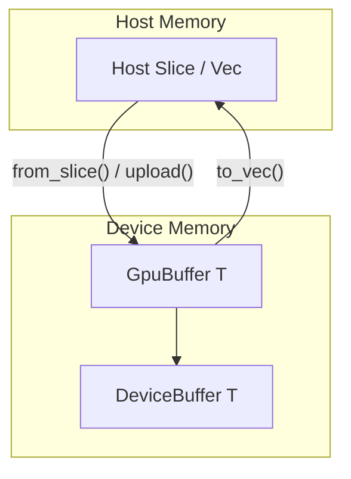
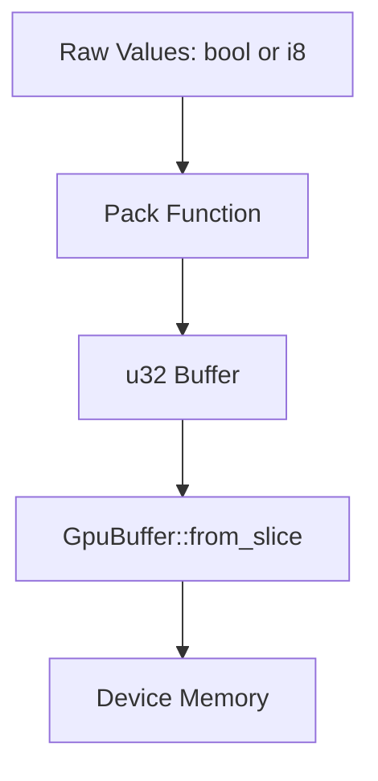
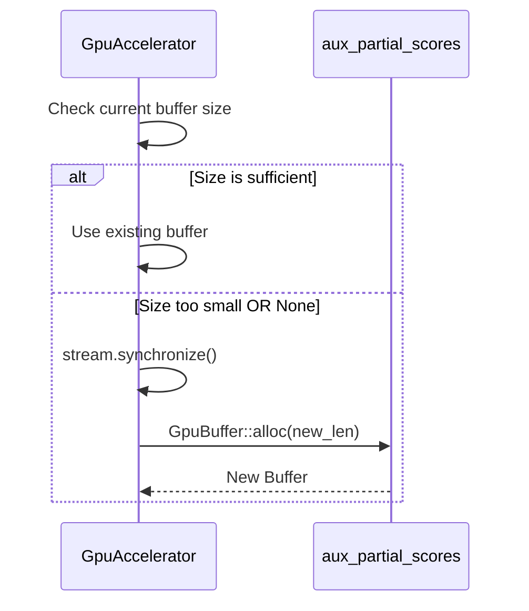

Relevant source files

The following files were used as context for generating this wiki page:

- [src/gpu/memory.rs](src/gpu/memory.rs)
- [src/gpu/accelerator.rs](src/gpu/accelerator.rs)
- [src/gpu_stub.rs](src/gpu_stub.rs)
- [src/bitpacking.rs](src/bitpacking.rs)
- [README.md](README.md)
- [src/gpu/error.rs](src/gpu/error.rs)

# GPU Memory Management

GPU Memory Management in the `myelin-accelerator` project provides a safe Rust interface for allocating, uploading, and downloading data to and from NVIDIA GPU devices. The system is designed with a "16 GB VRAM discipline," keeping kernel footprints static and bounded while delegating large memory costs to user-managed tensors. Sources: [README.md:16-18](README.md#L16-L18)

The system utilizes the `cust` library as a backend for CUDA memory operations when the `cuda` feature is enabled. It provides a consistent API through `GpuBuffer<T>`, which handles the lifecycle of device-resident data. For environments without GPU access, a stub implementation ensures API compatibility and graceful CPU fallbacks. Sources: [src/gpu/memory.rs:9-12](src/gpu/memory.rs#L9-L12), [src/gpu_stub.rs:56-58](src/gpu_stub.rs#L56-L58)

## Core Components

### GpuBuffer<T>
The primary data structure for memory management is `GpuBuffer<T>`. It represents an owned device buffer of type `T`. The implementation ensures that any type `T` used with the buffer must implement `cust::memory::DeviceCopy`. Sources: [src/gpu/memory.rs:14-17](src/gpu/memory.rs#L14-L17)

The following diagram illustrates the relationship between Host memory and the `GpuBuffer` on the Device:

Sources: [src/gpu/memory.rs:25-46](src/gpu/memory.rs#L25-L46)

### Lifecycle Methods
`GpuBuffer` provides several methods to manage the movement and allocation of data:

| Method | Description | Error Condition |
| :--- | :--- | :--- |
| `alloc(len)` | Allocates uninitialized device memory for `len` elements. | Fails if OOM or CUDA init fails. |
| `from_slice(data)` | Allocates and immediately uploads a host slice to the device. | Fails if allocation or copy fails. |
| `upload(data)` | Overwrites existing device memory from a host slice. | Fails if length mismatch or copy error. |
| `to_vec()` | Downloads device data into a new host-side `Vec`. | Fails if copy to host fails. |

Sources: [src/gpu/memory.rs:19-46](src/gpu/memory.rs#L19-L46), [src/gpu_stub.rs:65-87](src/gpu_stub.rs#L65-L87)

## Memory Optimization & Alignment

### Bitpacking
To minimize VRAM usage and maximize throughput for specific workloads (like spiking networks or SAT solvers), the project employs binary and ternary bitpacking. This allows representing multiple values within a single `u32` word. Sources: [src/bitpacking.rs:7-22](src/bitpacking.rs#L7-L22)

*  **Binary (1-bit):** 32 values per `u32` word. Sources: [src/bitpacking.rs:24](src/bitpacking.rs#L24)
*  **Ternary (2-bit):** 16 values per `u32` word (encoding {-1, 0, +1}). Sources: [src/bitpacking.rs:27](src/bitpacking.rs#L27)

Sources: [src/bitpacking.rs:37-45](src/bitpacking.rs#L37-L45), [src/bitpacking.rs:77-85](src/bitpacking.rs#L77-L85)

### Alignment Requirements
For optimal performance, particularly when using CUDA vectorized 128-bit loads, buffers should ideally maintain 16-byte alignment. Packed buffers are naturally 4-byte aligned as they contain `u32` elements. Sources: [src/bitpacking.rs:20-22](src/bitpacking.rs#L20-L22)

## Accelerator Integration

The `GpuAccelerator` manages auxiliary buffers used for intermediate computations, such as reduction passes in the SAT solver. These buffers are lazily reallocated if the required size exceeds the current allocation. Sources: [src/gpu/accelerator.rs:184-200](src/gpu/accelerator.rs#L184-L200)

Sources: [src/gpu/accelerator.rs:194-205](src/gpu/accelerator.rs#L194-L205)

## Error Handling
Memory operations return a `GpuResult<T>`, utilizing `GpuError::MemoryError` to report failures such as Out of Memory (OOM), illegal memory access, or length mismatches during host-device transfers. Sources: [src/gpu/error.rs:11](src/gpu/error.rs#L11), [src/gpu_stub.rs:20](src/gpu_stub.rs#L20)

## Conclusion
GPU Memory Management in `myelin-accelerator` provides a robust, type-safe abstraction over CUDA memory. By combining direct buffer management with specialized bitpacking utilities and lazy-allocation strategies in the accelerator, the system achieves high efficiency for Blackwell-class hardware while maintaining a small, static footprint for core kernel operations.
