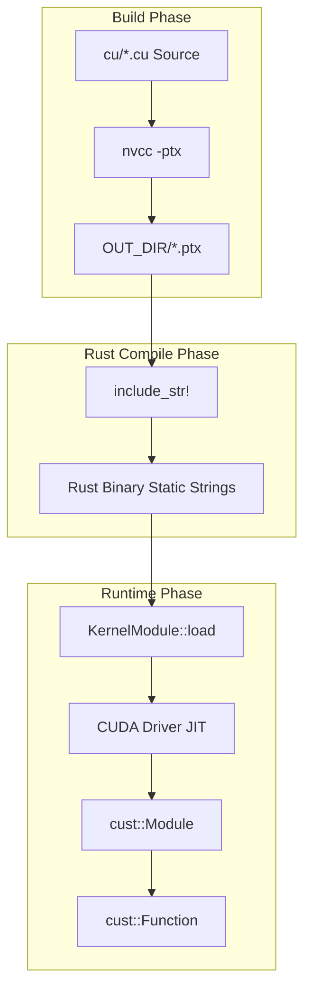
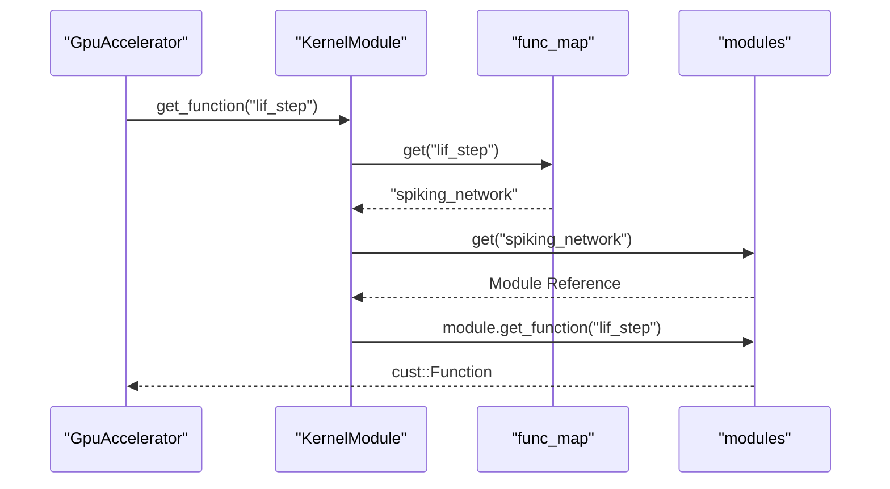

<details>
<summary>Relevant source files</summary>

The following files were used as context for generating this wiki page:

- [src/gpu/kernel.rs](src/gpu/kernel.rs)
- [build.rs](build.rs)
- [src/gpu/accelerator.rs](src/gpu/accelerator.rs)
- [CMakeLists.txt](CMakeLists.txt)
- [CLAUDE.md](CLAUDE.md)
- [REVIEW.md](REVIEW.md)
</details>

# PTX Module Loading

PTX (Parallel Thread Execution) module loading is the core mechanism by which `myelin-accelerator` manages CUDA device code. The system utilizes a compile-time embedding strategy to ensure that specialized kernels for spiking networks, vector similarity, and SAT solving are bundled directly within the Rust binary. This architecture eliminates runtime filesystem dependencies for kernel retrieval and enables JIT (Just-In-Time) compilation by the CUDA driver upon application initialization.

The loading process is designed to target Blackwell-class GPUs (`sm_120`) while maintaining a "CPU-safe" fallback path. When the `cuda` feature is disabled, the system writes and embeds stub PTX files to satisfy compilation requirements without requiring a CUDA toolkit or driver.

Sources: [src/gpu/kernel.rs:11-16](src/gpu/kernel.rs#L11-L16), [CLAUDE.md:23-28](CLAUDE.md#L23-L28), [README.md:16-20](README.md#L16-L20)

## Architecture Overview

The PTX loading system operates across three distinct phases: build-time compilation, compile-time embedding, and runtime JIT loading.

### Build-Time Compilation
The project uses `build.rs` and `CMakeLists.txt` to drive `nvcc`. It avoids CMake's native CUDA language support to bypass host compiler compatibility issues, instead using custom commands to compile `.cu` source files directly into `.ptx` files.

Sources: [build.rs:65-71](build.rs#L65-L71), [CMakeLists.txt:7-15](CMakeLists.txt#L7-L15), [REVIEW.md:12-19](REVIEW.md#L12-L19)

### Lifecycle Flow
The following diagram illustrates the transition of CUDA code from source to executable device function handles.



The lifecycle ensures that the bytes travel with the binary and JIT compilation takes < 1s on supported hardware. 
Sources: [src/gpu/kernel.rs:13-15](src/gpu/kernel.rs#L13-L15), [src/gpu/kernel.rs:43-46](src/gpu/kernel.rs#L43-L46), [build.rs:25-40](build.rs#L25-L40)

## Kernel Management Components

### KernelModule Struct
The `KernelModule` struct is the primary orchestrator for managing loaded CUDA modules and mapping function names to their respective modules.

| Field | Type | Description |
| :--- | :--- | :--- |
| `modules` | `HashMap<String, Module>` | Maps module names (e.g., "satsolver") to loaded `cust::Module` objects. |
| `func_map` | `HashMap<String, String>` | Maps specific kernel function names (e.g., "lif_step") to their parent module name. |

Sources: [src/gpu/kernel.rs:33-37](src/gpu/kernel.rs#L33-L37)

### Function Retrieval
Kernel functions are retrieved via the `get_function` method, which performs a two-stage lookup: identifying the module containing the function and then requesting the function handle from that module.



Sources: [src/gpu/kernel.rs:104-118](src/gpu/kernel.rs#L104-L118)

## Embedded Modules and Kernels

The system specifically targets three primary compute domains, each compiled into its own PTX module.

| Module Name | Source File | Key Kernels |
| :--- | :--- | :--- |
| `spiking_network` | `spiking_network.cu` | `poisson_encode`, `lif_step`, `lif_step_weighted`, `stdp_update`, `latent_reduce_pass2` |
| `vector_similarity`| `vector_similarity.cu`| `cosine_similarity_batched`, `cosine_similarity_top_k` |
| `satsolver` | `satsolver.cu` | `satsolver_step`, `satsolver_aux_update`, `satsolver_best_reduce_pass1` |

Sources: [src/gpu/kernel.rs:55-88](src/gpu/kernel.rs#L55-L88), [build.rs:15-19](build.rs#L15-L19)

## Versioning and JIT Requirements

The loader enforces strict versioning for Blackwell (`sm_120`) hardware. 

*  **PTX Floor:** Blackwell requires PTX ISA ≥ 9.0. The `build.rs` script ensures a floor of version `9.2` when compiling for `sm_120`.
*  **Driver Support:** Runtime JIT compilation for `sm_120` requires NVIDIA driver versions ≥ 570 and CUDA Toolkit ≥ 12.8 (or 13.x).
*  **Stub Fallback:** If the `cuda` feature is off, a stub PTX version `8.5` targeting `sm_80` is used to allow the project to compile on non-CUDA systems.

Sources: [build.rs:10-12](build.rs#L10-L12), [src/gpu/kernel.rs:125-128](src/gpu/kernel.rs#L125-L128), [REVIEW.md:126-130](REVIEW.md#L126-L130), [CLAUDE.md:14-16](CLAUDE.md#L14-L16)

## Implementation Detail: Compile-Time Embedding

The `include_str!` macro is used in conjunction with the `env!("OUT_DIR")` variable to pull in the generated PTX strings.

```rust
// src/gpu/kernel.rs:24-25
static SPIKING_NETWORK_PTX: &str =
    include_str!(concat!(env!("OUT_DIR"), "/spiking_network_sm_120.ptx"));
```

This ensures that the `KernelModule` can call `Module::from_ptx(ptx, &[])` at runtime without any I/O operations beyond the initial JIT pass performed by the driver.
Sources: [src/gpu/kernel.rs:21-31](src/gpu/kernel.rs#L21-L31), [src/gpu/kernel.rs:122-124](src/gpu/kernel.rs#L122-L124)

## Summary

PTX Module Loading in `myelin-accelerator` provides a robust, zero-I/O runtime deployment model for CUDA kernels. By leveraging Rust's build scripts for specialized `nvcc` orchestration and compile-time embedding for distribution, the system ensures that high-performance Blackwell kernels are always available to the `GpuAccelerator` whenever a compatible device and driver are present, while maintaining full compatibility with CPU-only environments.
