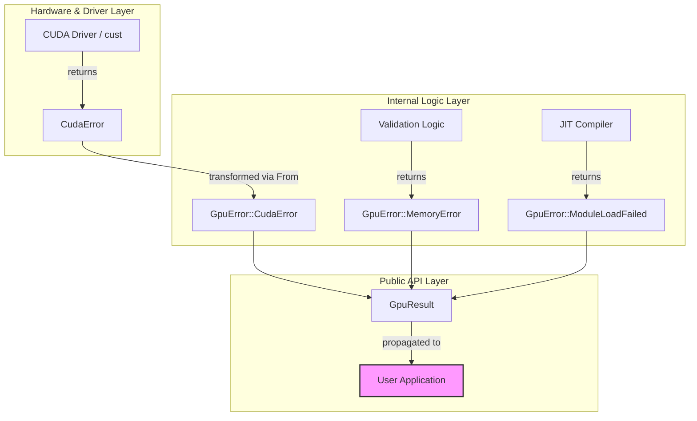
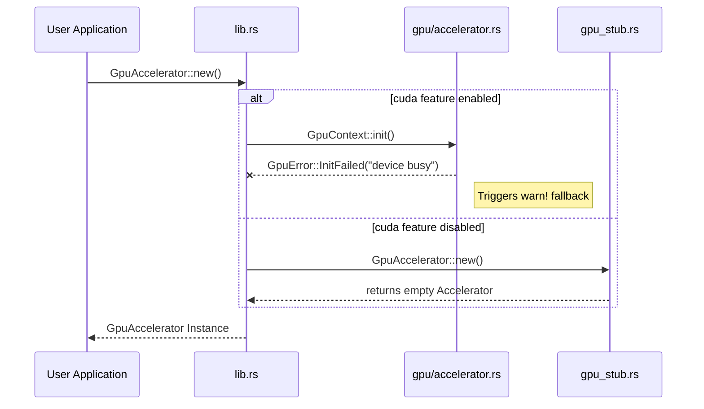

<details>
<summary>Relevant source files</summary>

The following files were used as context for generating this wiki page:

- [src/gpu/error.rs](src/gpu/error.rs)
- [src/gpu_stub.rs](src/gpu_stub.rs)
- [src/gpu/accelerator.rs](src/gpu/accelerator.rs)
- [src/gpu/kernel.rs](src/gpu/kernel.rs)
- [tests/api_contract.rs](tests/api_contract.rs)
- [src/lib.rs](src/lib.rs)

</details>

# Error Handling (GpuError)

The `GpuError` system provides a unified interface for handling failures across the myelin-accelerator stack. It encompasses issues ranging from physical hardware absence to Just-In-Time (JIT) compilation failures and runtime kernel launch errors. By providing a consistent `GpuResult<T>` type, the project ensures that both the real CUDA backend and the CPU-safe stub path maintain ABI compatibility and predictable error behavior.

This module is critical for the project's "Tier 1" support of Blackwell / RTX 5080-class GPUs, allowing the application to gracefully fall back to CPU implementations when specific CUDA features or hardware requirements (such as driver version ≥ 570) are not met.

Sources: [src/gpu/error.rs:1-15](src/gpu/error.rs#L1-L15), [src/lib.rs:1-15](src/lib.rs#L1-L15), [src/gpu_stub.rs:7-20](src/gpu_stub.rs#L7-L20)

## The GpuError Enumeration

The core of the error handling system is the `GpuError` enum. It categorizes various failure modes encountered during GPU operations.

### Error Variants
The following table describes the primary error variants supported by the system:

| Variant | Description | Implementation Context |
|:---|:---|:---|
| `NoGpu` | The system lacks a compatible GPU or was built without the `cuda` feature. | Default in `gpu_stub.rs` |
| `InitFailed(String)` | CUDA context or device initialization failed. | `GpuContext::init()` |
| `ModuleLoadFailed(String)` | PTX module failed to load or JIT-compile by the driver. | `KernelModule::load()` |
| `KernelNotFound(String)` | A specific kernel function symbol was not found in the loaded module. | `KernelModule::get_function()` |
| `MemoryError(String)` | Allocation, copy, or buffer length validation failed. | `GpuBuffer` operations |
| `LaunchFailed(String)` | Kernel launch or stream synchronization failed. | `GpuAccelerator` launches |
| `CudaError(String)` | Generic error forwarded from the underlying `cust` FFI wrapper. | FFI boundary |

Sources: [src/gpu/error.rs:13-28](src/gpu/error.rs#L13-L28), [src/gpu_stub.rs:8-16](src/gpu_stub.rs#L8-L16)

### Error Propagation and Display
The `GpuError` implements `std::fmt::Display` and `std::error::Error`, allowing it to integrate with standard Rust error handling ecosystems (e.g., `anyhow` or `tracing`). When the `cuda` feature is enabled, it also provides a `From` implementation for `cust::error::CudaError`, facilitating seamless propagation of low-level FFI errors into high-level project errors.

```rust
impl From<cust::error::CudaError> for GpuError {
    fn from(e: cust::error::CudaError) -> Self {
        GpuError::CudaError(format!("{e:?}"))
    }
}
```

Sources: [src/gpu/error.rs:30-47](src/gpu/error.rs#L30-L47), [src/gpu_stub.rs:18-30](src/gpu_stub.rs#L18-L30)

## Architecture and Data Flow

The error handling architecture follows a layered approach where errors originate at the FFI or hardware level and are wrapped as they move toward the public API.

### Error Transformation Flow
This diagram illustrates how low-level failures are captured and returned to the user interface or higher-level modules.



Sources: [src/gpu/error.rs:43-47](src/gpu/error.rs#L43-L47), [src/gpu/accelerator.rs:45-75](src/gpu/accelerator.rs#L45-L75), [src/gpu/kernel.rs:125-133](src/gpu/kernel.rs#L125-L133)

## Runtime Validation Logic

The `GpuAccelerator` uses `GpuError` to enforce strict safety constraints before launching kernels on the device.

### Length Validation
Before kernel execution, the accelerator validates buffer sizes to prevent illegal memory access. If a buffer is too small for the requested operation, a `GpuError::MemoryError` is returned, preventing the kernel launch.

```rust
fn expect_len(name: &str, actual: usize, minimum: usize) -> GpuResult<()> {
    if actual < minimum {
        return Err(GpuError::MemoryError(format!(
            "{name} too small: need at least {minimum} elements, got {actual}"
        )));
    }
    Ok(())
}
```

Sources: [src/gpu/accelerator.rs:248-255](src/gpu/accelerator.rs#L248-L255)

### Kernel Launch Safety
Kernel launches are wrapped in `unsafe` blocks, but the resulting `Result` is mapped into a `GpuResult`. If a launch fails due to resource exhaustion or illegal parameters, a `GpuError::LaunchFailed` is emitted with detailed diagnostic information.

Sources: [src/gpu/accelerator.rs:114-125](src/gpu/accelerator.rs#L114-L125), [src/gpu/accelerator.rs:207-224](src/gpu/accelerator.rs#L207-L224)

## GPU vs. Stub Implementation

The project maintains two versions of the error handling logic to support builds without CUDA toolkits.

### Sequence Diagram: Initialisation Failure
This diagram shows the difference in flow between the real GPU path and the CPU-stub path when initialization fails.



Sources: [src/lib.rs:10-20](src/lib.rs#L10-L20), [src/gpu/accelerator.rs:25-60](src/gpu/accelerator.rs#L25-L60), [src/gpu_stub.rs:100-110](src/gpu_stub.rs#L100-L110)

## Integration Testing and Contracts

The public API contract for error handling is validated through integration tests in `tests/api_contract.rs`. These tests ensure that:
- Error variants contain descriptive strings.
- The `GpuError` implements the standard error trait.
- Kernel launches fail gracefully with `GpuError::NoGpu` when no hardware is present.

Sources: [tests/api_contract.rs:125-155](tests/api_contract.rs#L125-L155)

### Summary
The `GpuError` system is the primary mechanism for safety and diagnostics in the `myelin-accelerator`. It provides a robust framework for capturing hardware-level failures, JIT compilation issues, and runtime validation errors, ensuring that the spiking-network kernels operate within safe memory bounds and provide clear feedback to the developer when failures occur.
