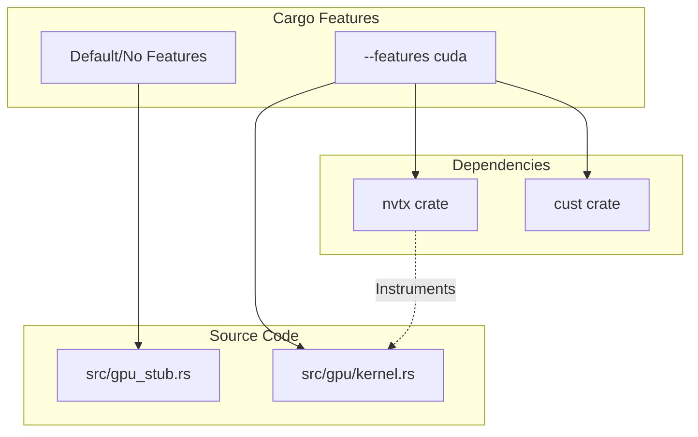
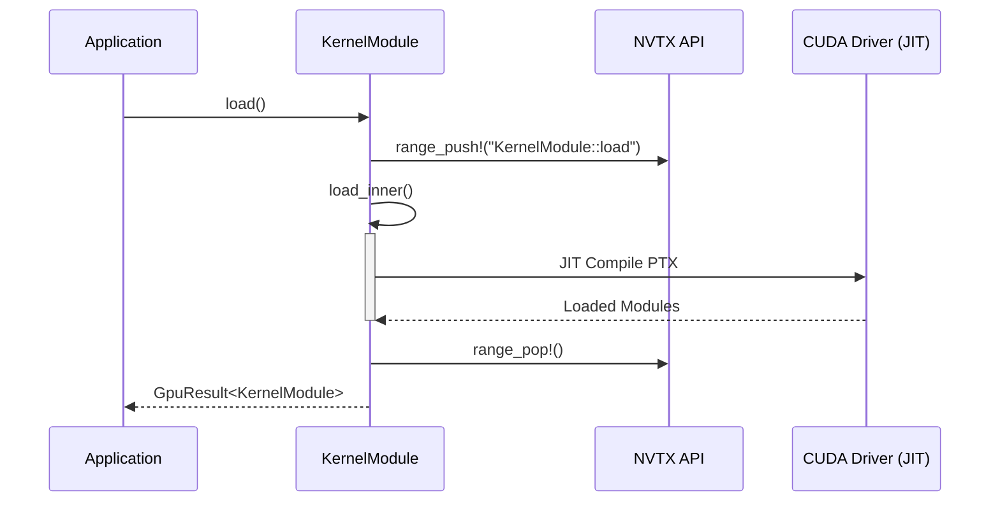

<details>
<summary>Relevant source files</summary>

The following files were used as context for generating this wiki page:

- [src/gpu/kernel.rs](src/gpu/kernel.rs)
- [REVIEW.md](REVIEW.md)
- [Cargo.toml](Cargo.toml)
- [CLAUDE.md](CLAUDE.md)
- [examples/benchmark.rs](examples/benchmark.rs)
</details>

# NVTX Profiling Instrumentation

NVTX (NVIDIA Tools Extension) profiling instrumentation in `myelin-accelerator` provides a mechanism for annotating the host-side Rust code to correlate CPU execution events with GPU activities in NVIDIA profiling tools like Nsight Systems and Nsight Compute. This instrumentation allows developers to see named time ranges on a timeline, facilitating the identification of bottlenecks during PTX module loading and kernel execution.

The instrumentation is designed to be optional and is strictly tied to the `cuda` feature flag. When the `cuda` feature is disabled, the project uses a CPU-safe path that does not link against the NVTX libraries, ensuring the crate remains portable and lightweight for non-GPU environments.

Sources: [CLAUDE.md:85-87](CLAUDE.md#L85-L87), [REVIEW.md:128-131](REVIEW.md#L128-L131), [Cargo.toml:16-18](Cargo.toml#L16-L18)

## Integration Architecture

The NVTX integration is managed through Cargo feature flags and conditional dependencies. The `nvtx` crate is an optional dependency that is only activated when the `cuda` feature is enabled.

### Feature Configuration
| Feature | Dependency | Purpose |
|---------|------------|---------|
| `cuda` | `nvtx`, `cust` | Enables real GPU execution and profiling instrumentation. |
| *(default)* | None | Uses `gpu_stub.rs`; no NVTX linking or GPU toolkit required. |

Sources: [Cargo.toml:16-18](Cargo.toml#L16-L18), [CLAUDE.md:38-41](CLAUDE.md#L38-L41), [REVIEW.md:144-148](REVIEW.md#L144-L148)



The diagram above illustrates how the `nvtx` dependency is conditionally included based on the `cuda` feature, which then enables instrumentation within the real GPU implementation files.
Sources: [Cargo.toml:16-18](Cargo.toml#L16-L18), [CLAUDE.md:38-41](CLAUDE.md#L38-L41), [REVIEW.md:139-142](REVIEW.md#L139-L142)

## Instrumentation Mechanism

The primary method of instrumentation involves wrapping high-latency or critical path operations in NVTX ranges. This is achieved using the `range_push!` and `range_pop!` macros (or equivalent function calls) provided by the `nvtx` crate.

### Instrumented Load-Bearing Code
Instrumentation is currently implemented in the PTX module loading sequence. This is a critical initialization step where PTX strings are JIT-compiled by the CUDA driver.

*  **`KernelModule::load()`**: This function serves as the entry point for loading all compile-time embedded PTX modules. It is wrapped in a `range_push!("KernelModule::load")` and `range_pop!()` pair.
*  **`load_inner()`**: The actual logic for mapping functions and loading modules (Spiking Network, Vector Similarity, and SAT Solver) is delegated here, while the parent `load()` handles the profiling markers.

Sources: [src/gpu/kernel.rs:43-52](src/gpu/kernel.rs#L43-L52), [REVIEW.md:139-142](REVIEW.md#L139-L142)

### Execution Flow with NVTX
The following sequence diagram shows how the NVTX markers are triggered during the kernel loading process:



Sources: [src/gpu/kernel.rs:46-55](src/gpu/kernel.rs#L46-L55)

## Usage and Verification

To utilize NVTX instrumentation, the crate must be compiled with the `cuda` feature. Developers can then use NVIDIA profiling tools to capture the markers.

### Capturing Profiles
Markers can be viewed by running the benchmark example through Nsight tools:

*  **Nsight Systems (Timeline)**: `nsys profile -o timeline cargo run --example benchmark --profile bench --features bench,cuda`
*  **Nsight Compute (Kernel Tuning)**: `ncu --set full -o profile cargo run --example benchmark --features bench,cuda`

Sources: [examples/benchmark.rs:31-41](examples/benchmark.rs#L31-L41), [REVIEW.md:213-214](REVIEW.md#L213-L214)

### Implementation Detail

```rust
// src/gpu/kernel.rs:46-51
pub fn load() -> GpuResult<Self> {
    range_push!("KernelModule::load");
    let result = Self::load_inner();
    range_pop!();
    result
}
```

Sources: [src/gpu/kernel.rs:46-51](src/gpu/kernel.rs#L46-L51)

## Conclusion
NVTX Profiling Instrumentation in `myelin-accelerator` provides visibility into the JIT compilation and module loading phases on the GPU path. By isolating this functionality under the `cuda` feature and focusing on critical initialization paths like `KernelModule::load`, the project maintains high performance and portability while offering deep diagnostic capabilities for Blackwell-class hardware optimization.

Sources: [REVIEW.md:139-142](REVIEW.md#L139-L142), [CLAUDE.md:38-41](CLAUDE.md#L38-L41)
