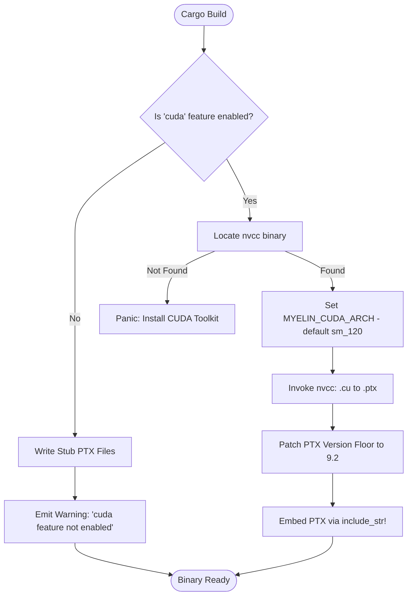
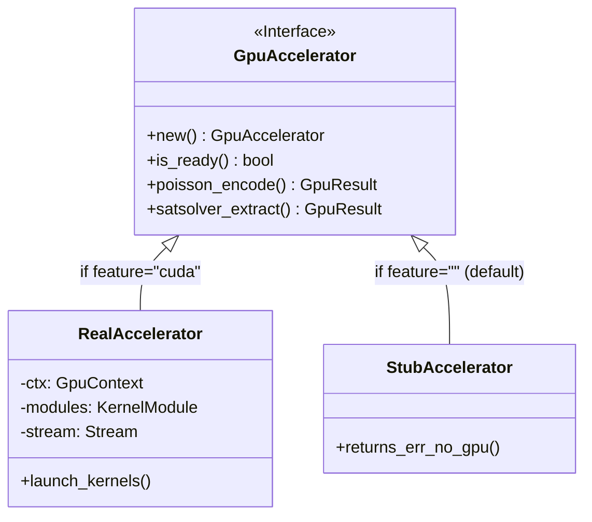

<details>
<summary>Relevant source files</summary>

The following files were used as context for generating this wiki page:

- [Cargo.toml](Cargo.toml)
- [README.md](README.md)
- [build.rs](build.rs)
- [CLAUDE.md](CLAUDE.md)
- [REVIEW.md](REVIEW.md)
- [src/gpu_stub.rs](src/gpu_stub.rs)
- [src/gpu/kernel.rs](src/gpu/kernel.rs)
- [CMakeLists.txt](CMakeLists.txt)
- [examples/benchmark.rs](examples/benchmark.rs)

</details>

# Cargo Build Features

`myelin-accelerator` utilizes Cargo features to manage its dual-path architecture, allowing the project to build successfully on environments with or without a CUDA toolkit. By default, the crate is "CPU-safe," providing stubs for GPU operations to facilitate CI testing and development in sandboxed environments. When the `cuda` feature is enabled, the crate transitions into a high-performance compute layer that compiles and embeds Blackwell-optimized CUDA kernels.

Sources: [README.md:32-37](README.md#L32-L37), [CLAUDE.md:20-25](CLAUDE.md#L20-L25), [Cargo.toml:13-17](Cargo.toml#L13-L17)

## Feature Matrix and Dependencies

The project defines three primary feature states that control dependency resolution and code inclusion.

| Feature | Description | Key Dependencies |
| :--- | :--- | :--- |
| **(default)** | CPU-safe path. No `nvcc` or GPU driver required. Uses `gpu_stub.rs`. | `anyhow`, `tracing` |
| **`cuda`** | Enables real GPU execution. Triggers `nvcc` compilation of `.cu` files. | `cust`, `nvtx` |
| **`bench`** | Enables benchmarking infrastructure and serialization for results. | `serde`, `serde_json` |

Sources: [Cargo.toml:13-25](Cargo.toml#L13-L25), [README.md:52-57](README.md#L52-L57), [CLAUDE.md:120-125](CLAUDE.md#L120-L125)

### Dependency Isolation
A critical design choice is the isolation of `nvtx` and `cust`. The project ensures that `nvtx` profiling macros (`range_push!`/`range_pop!`) are only linked when the `cuda` feature is active, preventing unnecessary overhead or link-time errors on CPU-only hosts.

Sources: [REVIEW.md:118-125](REVIEW.md#L118-L125), [Cargo.toml:15](Cargo.toml#L15)

## The Build Process Logic

The `build.rs` script orchestrates the compilation strategy based on the enabled features. It handles the identification of the CUDA toolkit, defines the GPU architecture (defaulting to Blackwell `sm_120`), and manages PTX versioning.

### Build Path Selection
The following diagram illustrates the logic executed by `build.rs` during the compilation phase:



The diagram shows the decision tree in `build.rs` for generating either functional PTX or stubs.
Sources: [build.rs:32-65](build.rs#L32-L65), [CLAUDE.md:22-30](CLAUDE.md#L22-L30)

### PTX Version Management
`build.rs` strictly manages the `.version` header in generated PTX files. 
- **Stub Path:** Writes `.version 8.5` and `.target sm_80` for compatibility with broader CPU-safe checks.
- **CUDA Path:** Blackwell (`sm_120`) requires PTX ISA ≥ 9.0. The build script ensures a floor of `9.2` for these architectures to prevent `InvalidPtx` errors at JIT time.

Sources: [build.rs:13-17](build.rs#L13-L17), [build.rs:72-85](build.rs#L72-L85), [REVIEW.md:148-155](REVIEW.md#L148-L155)

## Architectural Switch: Real vs. Stub

The crate employs a conditional module structure. The public API symbols (`GpuAccelerator`, `GpuBuffer`, etc.) are consistent, but their underlying implementation changes entirely based on the build feature.



The class diagram represents the high-level structural substitution between real GPU logic and CPU stubs.
Sources: [src/gpu_stub.rs:43-138](src/gpu_stub.rs#L43-L138), [src/gpu/accelerator.rs:22-55](src/gpu/accelerator.rs#L22-L55), [README.md:42-48](README.md#L42-L48)

### GPU Stub Behavior
When built without `cuda`, `src/gpu_stub.rs` defines a `GpuAccelerator` where:
- `is_ready()` always returns `false`.
- All kernel launch methods (e.g., `poisson_encode`) return `Err(GpuError::NoGpu)`.
- `GpuBuffer` acts as a simple `Vec<T>` wrapper to allow basic API testing without device memory allocation.

Sources: [src/gpu_stub.rs:104-138](src/gpu_stub.rs#L104-L138), [tests/api_contract.rs:43-65](tests/api_contract.rs#L43-L65)

## Benchmark Feature and External Tooling

The `bench` feature is specifically designed to support the `examples/benchmark.rs` harness. It enables the `serde` and `serde_json` dependencies required for exporting latency percentiles (p50, p95, p99) to `.json` and `.csv` files.

### Feature Combination for Benchmarking
To perform real GPU microbenchmarks, both the `bench` and `cuda` features must be provided:

```bash
cargo run --example benchmark --features bench,cuda
```

If only `--features bench` is used, the harness will report "Built without `cuda` feature (stub path)" and only perform host-side bitpacking benchmarks.

Sources: [examples/benchmark.rs:1-30](examples/benchmark.rs#L1-L30), [examples/benchmark.rs:567-575](examples/benchmark.rs#L567-L575), [CLAUDE.md:92-95](CLAUDE.md#L92-L95)

## Configuration Environment Variables

Build features are further configurable via environment variables read by `build.rs` and `CMakeLists.txt`.

| Variable | Source | Description |
| :--- | :--- | :--- |
| `CUDA_NVCC` | `build.rs` / `CMake` | Explicit path to the `nvcc` compiler binary. |
| `MYELIN_CUDA_ARCH` | `build.rs` | Target GPU architecture (e.g., `sm_120`). |
| `MYELIN_PTX_VERSION`| `build.rs` | Manual override for PTX ISA version. |
| `MYELIN_NVCC_THREADS`| `build.rs` | Number of threads `nvcc` uses for compilation (default: 0). |

Sources: [build.rs:37-43](build.rs#L37-L43), [build.rs:158-160](build.rs#L158-L160), [CMakeLists.txt:10-11](CMakeLists.txt#L10-L11)

## Conclusion
The Cargo build features in `myelin-accelerator` provide a robust mechanism for environment-aware compilation. By decoupling the CUDA dependency from the core Rust logic through a stubbing layer, the project ensures that Blackwell-optimized performance is available when hardware is present, while maintaining accessibility and testability on standard CPU environments.

Sources: [REVIEW.md:157-170](REVIEW.md#L157-L170), [README.md:88-95](README.md#L88-L95)
