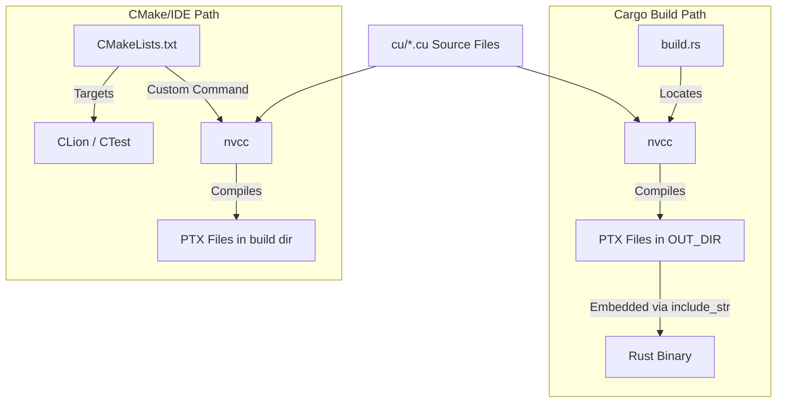
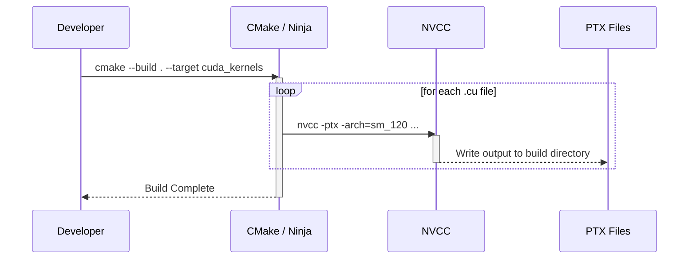

<details>
<summary>Relevant source files</summary>

The following files were used as context for generating this wiki page:

- [CMakeLists.txt](CMakeLists.txt)
- [build.rs](build.rs)
- [CLAUDE.md](CLAUDE.md)
- [REVIEW.md](REVIEW.md)
- [src/gpu/kernel.rs](src/gpu/kernel.rs)
</details>

# CMake & NVCC Integration

The `myelin-accelerator` project employs a specialized integration strategy for `nvcc` (NVIDIA CUDA Compiler) to compile CUDA kernels into Parallel Thread Execution (PTX) ISA. Instead of using CMake's native CUDA language support, which can encounter incompatibilities with modern host compilers like GCC 16, the project utilizes a dual-path build system. This system leverages `build.rs` for Cargo-driven builds and a custom `CMakeLists.txt` for IDE integration and quality gating.

This integration ensures that CUDA kernels are compiled to PTX with specific flags optimized for the Blackwell architecture (`sm_120`), providing a bridge between low-level CUDA code and high-level Rust FFI wrappers.

Sources: [REVIEW.md:7-14](REVIEW.md#L7-L14), [CLAUDE.md:21-31](CLAUDE.md#L21-L31), [CMakeLists.txt:4-10](CMakeLists.txt#L4-L10)

## Build Architecture and Tooling Dual-Path

The project supports two distinct paths for compiling CUDA kernels, both of which avoid CMake's `project(... CUDA)` to prevent compiler identification errors caused by host-compiler header incompatibilities.

### 1. Cargo Path (`build.rs`)
When the `cuda` feature is enabled in Cargo, `build.rs` locates `nvcc` on the system and executes it as a sub-process. It compiles `.cu` files into `.ptx` files, which are then stored in the Cargo `OUT_DIR`. These PTX files are embedded directly into the Rust binary at compile time using the `include_str!` macro in `src/gpu/kernel.rs`.

### 2. IDE/CMake Path (`CMakeLists.txt`)
The `CMakeLists.txt` file is designed primarily for CLion integration and CTest automation. It declares the project as `CXX` only and defines `add_custom_command` targets to drive `nvcc` manually. This allows developers to use IDE features for CUDA files without breaking the CXX-only setup.

Sources: [REVIEW.md:16-25](REVIEW.md#L16-L25), [CLAUDE.md:33-40](CLAUDE.md#L33-L40), [build.rs:41-49](build.rs#L41-L49), [src/gpu/kernel.rs:18-24](src/gpu/kernel.rs#L18-L24)



The diagram shows the parallel nature of the build system, where both paths consume the same CUDA source files but serve different purposes (production binary vs. developer tooling).
Sources: [CLAUDE.md:46-55](CLAUDE.md#L46-L55), [REVIEW.md:32-41](REVIEW.md#L32-L41)

## NVCC Compilation Configuration

Both `build.rs` and `CMakeLists.txt` are kept in sync to ensure identical compilation parameters. The primary target is the Blackwell architecture (`sm_120`).

### Compilation Flags
The project uses specific flags to bypass host compiler issues and optimize for GPU performance:

| Flag | Purpose |
|------|---------|
| `-ptx` | Compiles to PTX virtual ISA instead of binary cubin. |
| `-arch=sm_120` | Targets Blackwell / RTX 5080-class hardware. |
| `-std=c++17` | Forces C++17 to avoid C++23 header paths in GCC 16. |
| `-D__STRICT_ANSI__` | Dodges incompatible host-compiler header paths. |
| `--allow-unsupported-compiler` | Required for newer host toolchains. |
| `--expt-relaxed-constexpr` | Allows device-side relaxed constexpr logic. |
| `-Xcompiler -fno-builtin` | Prevents nvcc from misreading host builtins as device intrinsics. |

Sources: [CMakeLists.txt:14-25](CMakeLists.txt#L14-L25), [build.rs:141-155](build.rs#L141-L155), [REVIEW.md:19-25](REVIEW.md#L19-L25)

### PTX Version Management
`build.rs` implements logic to manage the `.version` header in generated PTX files. This is critical because `sm_120` requires a PTX ISA version of at least `9.2`.
- **Stub Path:** When `cuda` is disabled, a stub PTX with `.version 8.5` and `.target sm_80` is written.
- **Real Path:** `build.rs` ensures a floor of `.version 9.2` for Blackwell architectures, even if `nvcc` or user overrides attempt to set a lower version.

Sources: [build.rs:8-12](build.rs#L8-L12), [build.rs:75-90](build.rs#L75-L90), [REVIEW.md:83-91](REVIEW.md#L83-L91)

## CTest and Custom Targets

The CMake configuration provides several custom targets and CTest entries to automate the validation of both Rust and CUDA components.

| Target Name | Command | Description |
|-------------|---------|-------------|
| `cuda_kernels` | `nvcc -ptx ...` | Compiles all `.cu` files to PTX. |
| `cargo_test` | `cargo test --locked` | Runs the standard Rust test suite. |
| `cargo_fmt` | `cargo fmt --check` | Validates code formatting. |
| `cargo_clippy` | `cargo clippy ...` | Runs lints without default features. |
| `cargo_bench_example` | `cargo build --example benchmark` | Compiles the benchmark harness. |

Sources: [CMakeLists.txt:72-126](CMakeLists.txt#L72-L126), [REVIEW.md:27-35](REVIEW.md#L27-L35)



The sequence diagram illustrates the custom build process where CMake orchestrates `nvcc` compilation for individual kernel files.
Sources: [CMakeLists.txt:37-55](CMakeLists.txt#L37-L55)

## Kernel Discovery and Embedding

The integration extends into the Rust source code via `src/gpu/kernel.rs`. The PTX files produced by the build system are identified and mapped to specific kernel functions.

### PTX File Mapping
The build system tracks three primary CUDA source files:
- `spiking_network.cu`
- `vector_similarity.cu`
- `satsolver.cu`

In `src/gpu/kernel.rs`, these are embedded using the `include_str!` macro, which references the `OUT_DIR` environment variable set by `build.rs`.

```rust
static SPIKING_NETWORK_PTX: &str =
    include_str!(concat!(env!("OUT_DIR"), "/spiking_network_sm_120.ptx"));
```

Sources: [build.rs:14-18](build.rs#L14-L18), [src/gpu/kernel.rs:18-24](src/gpu/kernel.rs#L18-L24)

### NVCC Search Logic
`build.rs` employs a specific search priority to find the `nvcc` binary:
1.  The `CUDA_NVCC` environment variable.
2.  The `bin` subdirectory of `CUDA_HOME` or `CUDA_PATH`.
3.  The system `PATH`.

Sources: [build.rs:96-118](build.rs#L96-L118)

## Summary

The `CMake & NVCC Integration` provides a robust, dual-path build system that prioritizes technical accuracy and compiler compatibility. By eschewing native CMake CUDA support in favor of manual orchestration via `build.rs` and custom CMake commands, the project maintains high-performance targets for Blackwell GPUs while ensuring a seamless developer experience across both Cargo and IDE-driven workflows.
