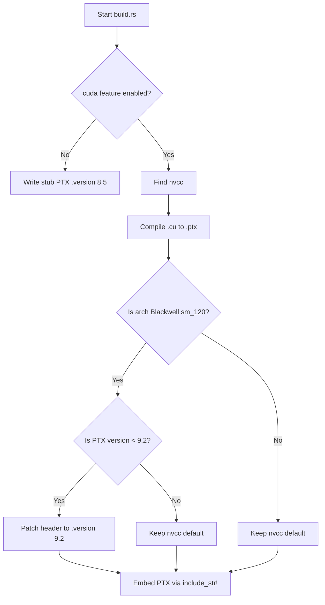
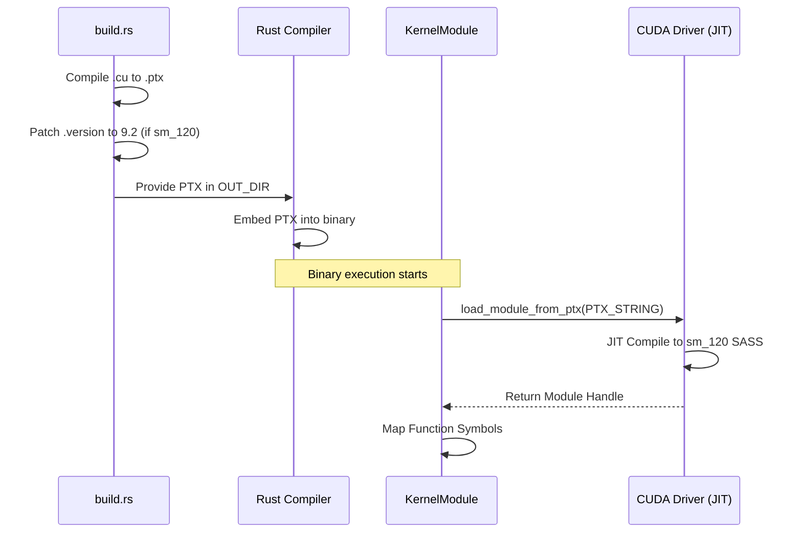

Relevant source files

The following files were used as context for generating this wiki page:

- [build.rs](build.rs)
- [REVIEW.md](REVIEW.md)
- [CLAUDE.md](CLAUDE.md)
- [CMakeLists.txt](CMakeLists.txt)
- [src/gpu/kernel.rs](src/gpu/kernel.rs)

# PTX Versioning & Blackwell Support

The `myelin-accelerator` project is designed as a Blackwell-first compute layer, specifically targeting RTX 5080-class hardware (architecture `sm_120`). Because Blackwell requires modern Parallel Thread Execution (PTX) Instruction Set Architecture (ISA) versions, the build system implements specialized versioning logic to ensure compatibility between the generated PTX code and the CUDA driver's Just-In-Time (JIT) compiler.

This system manages the compilation of CUDA kernels (`.cu` files) into PTX modules that are embedded directly into the Rust binary. It ensures that when targeting Blackwell architectures, the PTX version is floored to a minimum compatible level (ISA 9.2) to prevent JIT errors such as `InvalidPtx` (CUDA error 218) that occur when using older ISA versions with `sm_120` hardware.

Sources: [CLAUDE.md:14-16](CLAUDE.md#L14-L16), [REVIEW.md:124-129](REVIEW.md#L124-L129), [src/gpu/kernel.rs:10-14](src/gpu/kernel.rs#L10-L14)

## Blackwell Architecture Requirements

Blackwell support in `myelin-accelerator` centers on the `sm_120` compute capability. Supporting this architecture necessitates a specific software stack and minimum versioning requirements for both the CUDA toolkit and the system drivers.

### Software Stack Requirements
The project specifies a "local-first" quality gate for Blackwell support, as cloud runners often lack the necessary hardware and driver support for `sm_120`.

| Component | Minimum Requirement | Recommended |
|-----------|---------------------|-------------|
| Hardware | RTX 5080-class / Blackwell | `sm_120` |
| CUDA Toolkit | 13.2 | 13.3.1 |
| Driver Version | ≥ 570 | Latest Blackwell-ready |
| CUDA UMD | 13.x | 13.3 |
| PTX ISA Version | 9.0 | 9.2 |

Sources: [CLAUDE.md:23-28](CLAUDE.md#L23-L28), [REVIEW.md:124-126](REVIEW.md#L124-L126), [REVIEW.md:278-285](REVIEW.md#L278-L285)

## PTX Compilation & Version Patching Logic

The project uses a custom compilation pipeline to generate PTX files. This is handled both by `build.rs` (for Cargo builds) and `CMakeLists.txt` (for IDE/CLion integration). A critical feature of this pipeline is the post-compilation patching of PTX headers.

### Version Flooring for sm_120
If the build target is detected as Blackwell (`sm_120` or `compute_12*`), the build system enforces a floor for the `.version` directive in the PTX header. While `nvcc` 13.x typically emits version 9.2, the build script explicitly checks and raises the version to `9.2` if it is lower. This prevents the `InvalidPtx` errors encountered when `sm_120` targets were paired with earlier PTX versions (like 8.5).

The diagram shows the logic flow for PTX generation and the specific versioning floor applied to Blackwell architectures.
Sources: [build.rs:11-15](build.rs#L11-L15), [build.rs:88-106](build.rs#L88-L106), [REVIEW.md:124-129](REVIEW.md#L124-L129)

### Compilation Environment Variables
The build behavior can be influenced by several environment variables handled in `build.rs`.

| Variable | Description | Default |
|----------|-------------|---------|
| `MYELIN_CUDA_ARCH` | Targeted CUDA architecture | `sm_120` |
| `MYELIN_PTX_VERSION` | Manual override for PTX version | (unset) |
| `CUDA_NVCC` | Path to the `nvcc` compiler | (searches PATH/CUDA_HOME) |
| `MYELIN_NVCC_THREADS` | Number of threads for parallel nvcc execution | 0 |

Sources: [build.rs:36-41](build.rs#L36-L41), [build.rs:80](build.rs#L80), [build.rs:160-163](build.rs#L160-L163)

## JIT Loading & Kernel Management

Kernels are not loaded from the filesystem at runtime. Instead, the generated PTX strings are embedded into the binary using `include_str!` and JIT-compiled by the CUDA driver upon initialization.

### The KernelModule Lifecycle
The `KernelModule` struct manages the transition from embedded PTX text to executable CUDA functions.

1.  **Embedding:** `src/gpu/kernel.rs` uses `concat!` and `env!("OUT_DIR")` to include the PTX files generated during the build phase.
2.  **JIT Compilation:** The `load_module_from_ptx` function calls the CUDA driver's JIT compiler. For `sm_120` hardware, this compilation typically occurs in less than one second.
3.  **Symbol Mapping:** Kernel functions (e.g., `poisson_encode`, `satsolver_step`) are mapped to their respective modules for fast retrieval via a `HashMap`.

This diagram illustrates the progression from source code to a JIT-compiled module ready for execution on Blackwell hardware.
Sources: [src/gpu/kernel.rs:20-30](src/gpu/kernel.rs#L20-L30), [src/gpu/kernel.rs:50-100](src/gpu/kernel.rs#L50-L100), [src/gpu/kernel.rs:133-142](src/gpu/kernel.rs#L133-L142)

## Build System Integration

The project avoids CMake's native `project(... CUDA)` language support due to incompatibilities between modern GCC headers (e.g., GCC 16/libstdc++) and the `nvcc` host compiler front-end. Instead, both `build.rs` and `CMakeLists.txt` drive `nvcc` directly as a custom command to produce PTX files.

### Compiler Flags for PTX Quality
Specific flags are used to ensure the PTX is optimized and compatible:
- `-std=c++17`: Used to avoid C++23 header paths that cause failures in the `nvcc` front-end.
- `--allow-unsupported-compiler`: Bypasses strict host compiler version checks.
- `--expt-relaxed-constexpr`: Enables modern C++ features in device code.
- `-Xcompiler -fno-builtin`: Prevents `nvcc` from misidentifying host built-ins as device intrinsics.

Sources: [CMakeLists.txt:11-25](CMakeLists.txt#L11-L25), [REVIEW.md:12-25](REVIEW.md#L12-L25), [build.rs:172-183](build.rs#L172-L183)

## Summary of Blackwell Support
The Blackwell (`sm_120`) support in `myelin-accelerator` is a specialized path that ensures hardware-specific optimizations (like warp-participating reductions) are matched with the correct PTX ISA version (≥ 9.2). By implementing manual header patching in the build script and sidestepping standard CMake CUDA detection, the project maintains high performance and compatibility on the latest NVIDIA hardware while avoiding host-toolchain conflicts.

Sources: [README.md:12-16](README.md#L12-L16), [REVIEW.md:124-129](REVIEW.md#L124-L129), [CLAUDE.md:23-28](CLAUDE.md#L23-L28)
