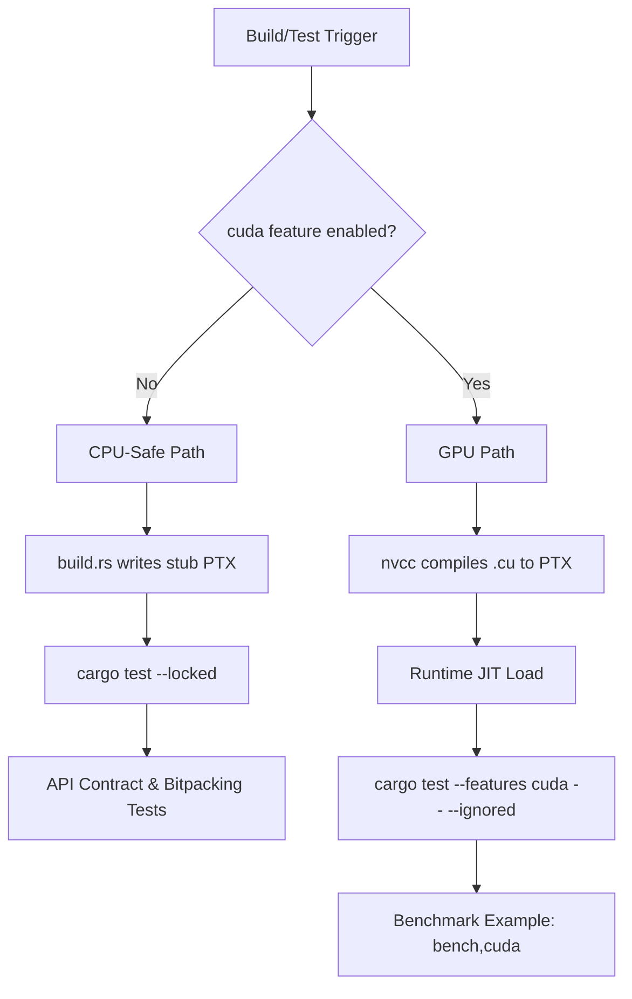
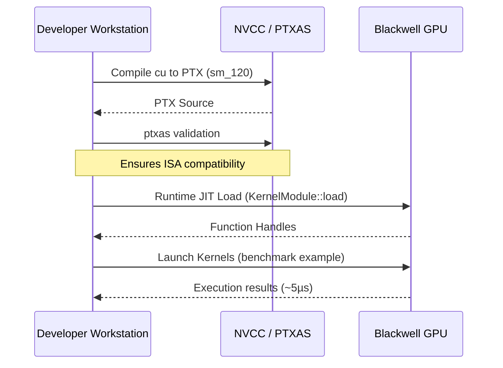

<details>
<summary>Relevant source files</summary>

The following files were used as context for generating this wiki page:

- [CLAUDE.md](CLAUDE.md)
- [REVIEW.md](REVIEW.md)
- [CMakeLists.txt](CMakeLists.txt)
- [tests/api_contract.rs](tests/api_contract.rs)
- [examples/benchmark.rs](examples/benchmark.rs)
- [build.rs](build.rs)
- [AGENTS.md](AGENTS.md)
</details>

# Testing Strategy & CI

The testing strategy for `myelin-accelerator` is designed to handle the dual nature of the project: a high-performance Rust library and a set of CUDA kernels targeting Blackwell (`sm_120`) architecture. The strategy differentiates between **CPU-safe** paths, which allow for standard linting and unit testing without specialized hardware, and **GPU-specific** paths, which require a physical NVIDIA GPU and appropriate drivers.

This architecture ensures that cloud-based CI runners can validate core logic and FFI contracts via stubs, while local or self-hosted environments with Blackwell-class GPUs perform the full runtime proof of CUDA kernels.

Sources: [CLAUDE.md:15-30](CLAUDE.md#L15-L30), [REVIEW.md:144-155](REVIEW.md#L144-L155)

## Dual-Path Validation Architecture

The project employs two distinct execution paths for validation to ensure developer productivity across different hardware environments.

### CPU-Safe Path (Default)
This path is intended for standard CI environments (e.g., GitHub Actions) and sandboxed development. It utilizes `src/gpu_stub.rs` when the `cuda` feature is disabled. In this mode, `build.rs` generates stub PTX files, and tests focus on API contracts, bitpacking logic, and ensuring graceful failure when a GPU is absent.

### GPU / CUDA Path
Enabled via `--features cuda`, this path triggers actual `nvcc` compilation of `.cu` files into PTX. It requires the CUDA Toolkit (13.2+) and a driver compatible with `sm_120` (driver version ≥ 570).



The diagram shows how the build system branches based on the `cuda` feature flag.
Sources: [CLAUDE.md:17-26](CLAUDE.md#L17-L26), [REVIEW.md:180-210](REVIEW.md#L180-L210), [build.rs:36-42](build.rs#L36-L42)

## Test Suites and Execution

Testing is categorized into linting, contract validation, and performance benchmarking.

### CTest Integration
The project uses `CMakeLists.txt` to provide a unified entry point for testing via CTest. This allows IDEs like CLion to drive the complete suite of Rust and CUDA validation.

| CTest Name | Command | Purpose |
| :--- | :--- | :--- |
| `cargo_tests` | `cargo test --locked` | Core unit and integration tests |
| `cargo_fmt_check` | `cargo fmt --check` | Style enforcement |
| `cargo_clippy_no_default` | `cargo clippy --locked --no-default-features` | Static analysis/linting |
| `cuda_kernel_build` | `cmake --build . --target cuda_kernels` | Validates CUDA source compilation to PTX |
| `cargo_build_bench_example` | `cargo build --features bench --example benchmark` | Ensures performance harness compiles |

Sources: [REVIEW.md:23-35](REVIEW.md#L23-L35), [CMakeLists.txt:80-140](CMakeLists.txt#L80-L140)

### API Contract Testing
Integration tests in `tests/api_contract.rs` validate the public FFI and buffer management. Bitpacking tests for binary and ternary formats run unconditionally as they are pure Rust logic. GPU-specific symbols are tested for graceful `GpuError::NoGpu` returns when the `cuda` feature is disabled.

```rust
#[cfg(not(feature = "cuda"))]
mod stub_contract {
    #[test]
    fn context_init_returns_error_without_gpu() {
        let result = GpuContext::init();
        assert!(result.is_err());
    }
}
```

Sources: [tests/api_contract.rs:1-122](tests/api_contract.rs#L1-L122)

## GPU Quality Gate (Local & Self-Hosted)

Because standard cloud runners lack Blackwell GPUs, the "GPU Quality Gate" is primarily a local or self-hosted requirement.

1.  **Compilation:** Real CUDA path compilation via `cargo build --features cuda`.
2.  **Offline Assembly:** Validating generated PTX using `ptxas -arch=sm_120`.
3.  **Runtime JIT:** Running ignored tests (`-- --ignored`) which attempt to load kernels into a real GPU context.
4.  **Performance:** Running `examples/benchmark.rs` to verify kernel execution times (typically ~5 µs for key kernels like `poisson_encode`).



The sequence shows the validation steps required for a full GPU quality gate.
Sources: [REVIEW.md:218-245](REVIEW.md#L218-L245), [CLAUDE.md:65-75](CLAUDE.md#L65-L75)

## Continuous Integration (CI) Logic

The CI environment distinguishes between "Lint/CPU checks" and "CUDA builds".

*  **GitHub-hosted `ubuntu-latest`:** Executes the CPU-safe path, including `clippy`, `fmt`, and `cargo test` without default features.
*  **Self-hosted Runners:** Labeled with `gpu` and `cuda`, these runners execute the `cuda-build` workflow, performing PTX file checks and compilation validation if available.

The `build.rs` script plays a critical role in CI by detecting the environment. If `MYELIN_PTX_VERSION` is not explicitly set in CI, `build.rs` automatically applies a floor of `.version 9.2` for `sm_120` targets to prevent JIT failures while allowing `nvcc` to use its default header for other architectures.

Sources: [REVIEW.md:280-305](REVIEW.md#L280-L305), [build.rs:48-60](build.rs#L48-L60), [CLAUDE.md:50-60](CLAUDE.md#L50-L60)

## Performance Benchmarking

Performance is tracked via `examples/benchmark.rs`, which serves as both a latency harness and a GPU information tool. It collects metadata such as device name, SM architecture, and VRAM capacity using `cust` when the `cuda` feature is active.

### Benchmark Configuration
| Parameter | Default | Description |
| :--- | :--- | :--- |
| `--warmup` | 10 | Iterations before timing starts |
| `--iterations` | 100 | Timed iterations for statistical analysis |
| `--baseline` | N/A | Optional JSON file for comparison |

Sources: [examples/benchmark.rs:56-115](examples/benchmark.rs#L56-L115), [examples/benchmark.rs:248-260](examples/benchmark.rs#L248-L260)

This testing strategy ensures that while the project pushes the boundaries of Blackwell GPU performance, the development workflow remains accessible on standard CPU-only environments.

Sources: [CLAUDE.md:32-40](CLAUDE.md#L32-L40), [AGENTS.md:7-15](AGENTS.md#L7-L15)
