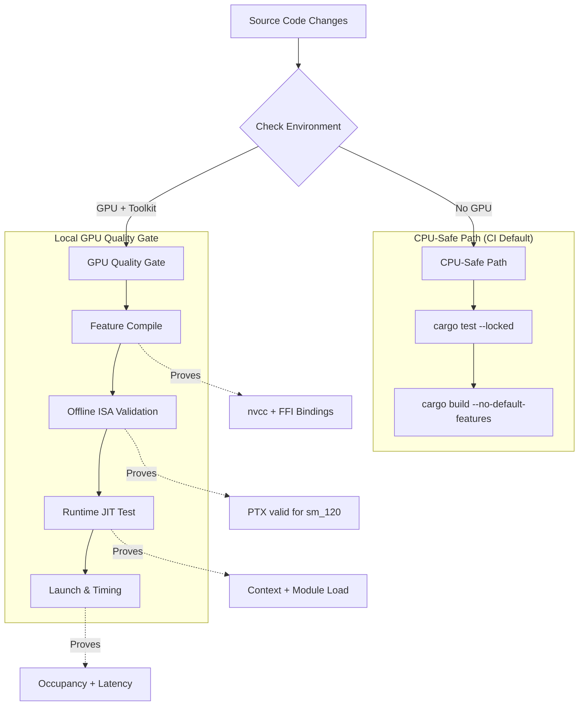

<details>
<summary>Relevant source files</summary>

The following files were used as context for generating this wiki page:

- [REVIEW.md](REVIEW.md)
- [CLAUDE.md](CLAUDE.md)
- [README.md](README.md)
- [CMakeLists.txt](CMakeLists.txt)
- [build.rs](build.rs)
- [examples/benchmark.rs](examples/benchmark.rs)
</details>

# Local GPU Quality Gate

The Local GPU Quality Gate is a critical validation framework for the `myelin-accelerator` project, designed to ensure that CUDA kernels and their Rust FFI wrappers function correctly on target hardware. Because cloud CI environments often lack the specific Blackwell-class GPUs (`sm_120`) required for full runtime proof, this quality gate serves as the authoritative "source of truth" for GPU readiness, relying on local or self-hosted environments equipped with appropriate drivers and hardware.

Sources: [REVIEW.md:123-138](REVIEW.md#L123-L138), [CLAUDE.md:68-71](CLAUDE.md#L68-L71)

## Core Objectives and Architecture

The quality gate is structured to separate "CPU-safe" linting and stub-based builds from "GPU-active" runtime validation. It utilizes a combination of Cargo features, CMake custom commands, and specific hardware requirements to provide end-to-end verification of the compute layer.

### System Components

| Component | Responsibility |
| :--- | :--- |
| **Cargo `cuda` Feature** | Enables the real GPU path, linking `cust` and `nvtx` dependencies and triggering PTX compilation. |
| **`build.rs`** | Manages `nvcc` invocation, arch-specific PTX versioning (e.g., sm_120 floor), and PTX embedding. |
| **`CMakeLists.txt`** | Provides IDE-friendly kernel compilation (`cuda_kernels`) and CTest integration for local developers. |
| **`benchmark.rs`** | Provides microbenchmark latency percentiles and verifies kernel launch success. |

Sources: [README.md:38-51](README.md#L38-L51), [REVIEW.md:200-210](REVIEW.md#L200-L210), [CLAUDE.md:22-31](CLAUDE.md#L22-L31), [build.rs:37-64](build.rs#L37-L64)

### Validation Workflow

The following diagram illustrates the progression from basic code checks to full hardware-backed validation:



The diagram shows how the project handles two distinct validation paths based on hardware availability. Sources: [REVIEW.md:141-150](REVIEW.md#L141-L150), [REVIEW.md:247-258](REVIEW.md#L247-L258), [CLAUDE.md:33-40](CLAUDE.md#L33-L40)

## Implementation Details

### Kernel Compilation and ISA Floor
The quality gate enforces a minimum PTX ISA version for Blackwell (`sm_120`) hardware. Specifically, `build.rs` and `CMakeLists.txt` are configured to ensure a floor of PTX 9.2 for `sm_12*` architectures to avoid `InvalidPtx` errors during JIT compilation.

```rust
// build.rs implementation of ISA floor
if is_blackwell {
    ensure_min_ptx_version(&output, DEFAULT_REAL_PTX_VERSION);
    println!("cargo:warning=compiled {cu_name} -> {ptx_name} (arch={arch}, ptx>={DEFAULT_REAL_PTX_VERSION})");
}
```

Sources: [build.rs:65-71](build.rs#L65-L71), [REVIEW.md:111-120](REVIEW.md#L111-L120)

### Integrated Testing (CTest)
The project utilizes `CMakeLists.txt` to drive `nvcc` via `add_custom_command`. This sidesteps CMake's native CUDA language identification issues with newer GCC headers while providing a structured test suite via `ctest`.

| CTest Target | Command | Purpose |
| :--- | :--- | :--- |
| `cargo_tests` | `cargo test --locked` | CPU-safe unit tests |
| `cuda_kernel_build` | `cmake --build ... --target cuda_kernels` | Verifies `nvcc` PTX compilation |
| `cargo_build_bench_example` | `cargo build --features bench --example benchmark` | Verifies benchmark harness compilation |

Sources: [CMakeLists.txt:75-135](CMakeLists.txt#L75-L135), [REVIEW.md:19-35](REVIEW.md#L19-L35)

## Local Quality Gate Checklist

For a build to be considered "proven green," it must pass the following local validation steps on a machine with a Blackwell GPU (RTX 5080 class) and driver ≥ 570:

1.  **Feature Compile**: Execute `cargo build --lib --features cuda`. This confirms `nvcc` is present and successfully embeds PTX into the Rust binary.
2.  **Offline Assembly**: Use `ptxas -arch=sm_120` on generated PTX files to ensure the intermediate code is valid for the target architecture.
3.  **Runtime JIT Test**: Run `cargo test --features cuda -- --ignored`. This triggers `KernelModule::load()` on the physical device to verify the CUDA context and symbol resolution.
4.  **Performance Baseline**: Execute the benchmark harness:
  `cargo run --example benchmark --profile bench --features bench,cuda`
  Expected results for kernels like `poisson_encode_4096` should show a mean latency in the ~5 µs range on RTX 5080 hardware.

Sources: [REVIEW.md:213-244](REVIEW.md#L213-L244), [CLAUDE.md:73-82](CLAUDE.md#L73-L82), [examples/benchmark.rs:326-340](examples/benchmark.rs#L326-L340)

## Conclusion
The Local GPU Quality Gate ensures the integrity of the `myelin-accelerator` compute layer by mandating hardware-specific validation that cloud CI cannot provide. By enforcing strict PTX ISA versions and providing a comprehensive suite of local tools (Cargo, CMake, and custom benchmarks), the project maintains stability for high-performance Blackwell-class GPU workloads.

Sources: [REVIEW.md:123-130](REVIEW.md#L123-L130), [README.md:6-12](README.md#L6-L12)
