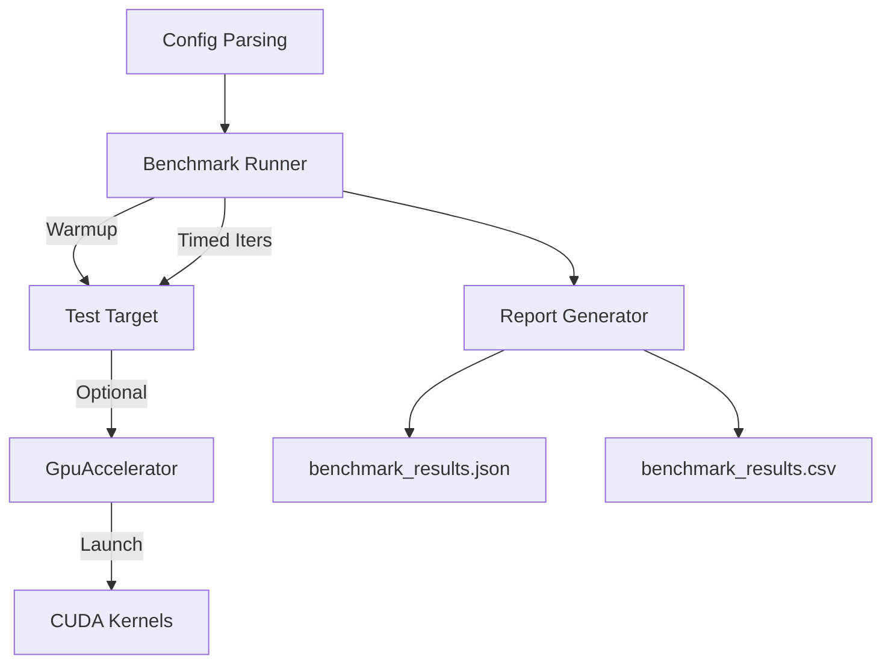
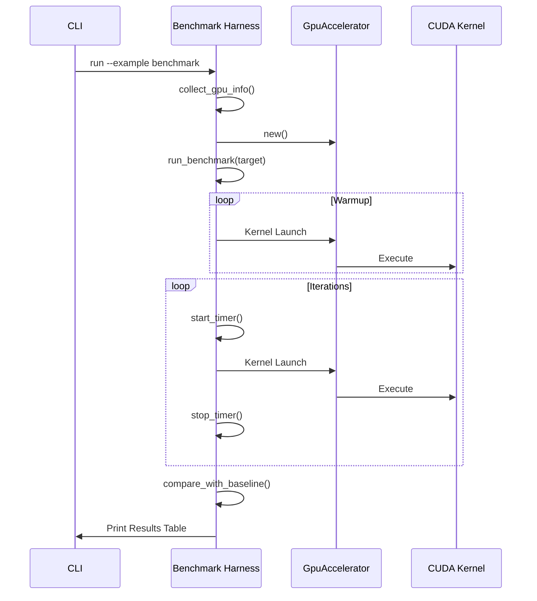

Relevant source files

The following files were used as context for generating this wiki page:

- [examples/benchmark.rs](examples/benchmark.rs)
- [REVIEW.md](REVIEW.md)
- [src/gpu/accelerator.rs](src/gpu/accelerator.rs)
- [src/gpu/kernel.rs](src/gpu/kernel.rs)
- [src/gpu_stub.rs](src/gpu_stub.rs)
- [src/bitpacking.rs](src/bitpacking.rs)
- [CLAUDE.md](CLAUDE.md)

# GPU Microbenchmarks

The GPU Microbenchmarks system provides a reproducible harness for measuring the performance of CUDA kernels and bitpacking utilities within the `myelin-accelerator` project. It is designed to target Blackwell / RTX 5080-class GPUs (`sm_120`) while maintaining a CPU-safe path for environments without hardware acceleration. The benchmarks capture latency percentiles (p50, p95, p99), throughput, and detailed GPU hardware information to ensure performance stability across iterations.

Sources: [examples/benchmark.rs:1-33](examples/benchmark.rs#L1-L33), [CLAUDE.md:27-32](CLAUDE.md#L27-L32), [README.md:1-5](README.md#L1-L5)

## Benchmark Architecture

The benchmarking system is structured as a standalone example that interacts with the project's core FFI wrappers and GPU management logic. It utilizes a configurable runner that performs warmup iterations followed by timed executions.

### Component Interaction

The following diagram illustrates how the benchmark harness coordinates between host-side logic and the GPU accelerator.

The benchmark harness manages configuration, execution, and data persistence for both CPU and GPU targets.
Sources: [examples/benchmark.rs:36-118](examples/benchmark.rs#L36-L118), [examples/benchmark.rs:163-214](examples/benchmark.rs#L163-L214)

### Data Structures

Key data structures define the reporting format and the configuration of the benchmark run:

| Structure | Purpose | Key Fields |
|:---|:---|:---|
| `BenchmarkResult` | Individual test metrics | `name`, `mean_us`, `p50_us`, `throughput_ops_per_sec` |
| `BenchmarkReport` | Complete run summary | `timestamp`, `gpu_info`, `config`, `results` |
| `GpuInfo` | Hardware telemetry | `device_name`, `sm_arch`, `vram_total_mb`, `cuda_version` |
| `Config` | CLI execution flags | `warmup`, `iterations`, `baseline`, `output_prefix` |

Sources: [examples/benchmark.rs:118-161](examples/benchmark.rs#L118-L161), [examples/benchmark.rs:36-45](examples/benchmark.rs#L36-L45)

## Execution Flow

The benchmarking process follows a strict sequence of initialization, execution, and comparison.

The sequence ensures the GPU is primed via warmup iterations before recording performance metrics.
Sources: [examples/benchmark.rs:521-565](examples/benchmark.rs#L521-L565), [examples/benchmark.rs:163-183](examples/benchmark.rs#L163-L183)

## Kernel Benchmarks

Kernel benchmarks require the `cuda` feature and a compatible hardware environment. They specifically target high-performance routines implemented in the `cu/` directory.

### Targeted Kernels
The harness benchmarks specific workloads designed for the Blackwell architecture:
*  **Poisson Encoding:** Benchmarks `poisson_encode` using 4096 stimuli.
*  **SAT Solver Extraction:** Benchmarks `satsolver_extract` with a 1024x256 problem size.

Sources: [examples/benchmark.rs:356-389](examples/benchmark.rs#L356-L389), [src/gpu/accelerator.rs:141-155](src/gpu/accelerator.rs#L141-L155), [src/gpu/accelerator.rs:247-260](src/gpu/accelerator.rs#L247-L260)

### GPU Information Probing
When the `cuda` feature is active, the system uses the `cust` crate to probe device attributes. It collects the device name, total VRAM, and the SM architecture (e.g., `sm_120`). It also attempts to resolve the `nvcc` version by searching `CUDA_NVCC`, `CUDA_HOME`, or the system `PATH`.

Sources: [examples/benchmark.rs:218-278](examples/benchmark.rs#L218-L278), [REVIEW.md:112-118](REVIEW.md#L112-L118)

## Bitpacking Benchmarks

Bitpacking benchmarks evaluate the efficiency of host-side binary and ternary packing, which are critical for preparing data for GPU consumption. These run on the CPU and do not require the `cuda` feature.

### Packing Types
| Type | Word Capacity | Encoding |
|:---|:---|:---|
| **Binary** | 32 values / `u32` | `true` → 1, `false` → 0 |
| **Ternary** | 16 values / `u32` | `0` → `0b00`, `+1` → `0b01`, `-1` → `0b10` |

Sources: [src/bitpacking.rs:10-25](src/bitpacking.rs#L10-L25), [examples/benchmark.rs:284-289](examples/benchmark.rs#L284-L289)

### Benchmark Targets
*  **Binary Pack/Unpack:** Measured at sizes 256 and 65536.
*  **Ternary Pack/Unpack:** Evaluated using patterns of `{-1, 0, 1}` at sizes 256 and 65536.

Sources: [examples/benchmark.rs:291-354](examples/benchmark.rs#L291-L354)

## Performance Analysis Tools

The system provides multiple ways to analyze results beyond the standard output:

### Baseline Comparison
Users can provide a previous JSON result via the `--baseline` flag. The harness calculates the percentage change in mean latency and flags regressions:
*  **Slower:** > 5% increase in latency.
*  **Faster:** > 5% decrease in latency.
*  **Same:** Within +/- 5% delta.

Sources: [examples/benchmark.rs:393-437](examples/benchmark.rs#L393-L437)

### Profiler Integration
The harness is designed to work with NVIDIA's profiling suite:
*  **Nsight Compute (`ncu`):** For detailed kernel performance and SM occupancy analysis.
*  **Nsight Systems (`nsys`):** For timeline profiling and FFI latency visualization.
*  **NVTX Instrumentation:** Kernel loading and critical paths are instrumented with `nvtx` ranges (e.g., `KernelModule::load`) to provide context in profiling timelines.

Sources: [examples/benchmark.rs:27-33](examples/benchmark.rs#L27-L33), [src/gpu/kernel.rs:44-48](src/gpu/kernel.rs#L44-L48), [REVIEW.md:95-104](REVIEW.md#L95-L104)

## Configuration Summary

The benchmark behavior is controlled via CLI flags:

| Flag | Default | Description |
|:---|:---|:---|
| `--warmup <N>` | 10 | Number of iterations before timing begins |
| `--iterations <N>` | 100 | Number of timed iterations |
| `--baseline <FILE>` | N/A | Path to a previous JSON report for comparison |
| `--output <PREFIX>` | `benchmark_results` | Prefix for generated JSON and CSV files |

Sources: [examples/benchmark.rs:40-44](examples/benchmark.rs#L40-L44), [examples/benchmark.rs:106-114](examples/benchmark.rs#L106-L114)

## Conclusion

The GPU Microbenchmark suite is a critical component for maintaining the performance profile of the `myelin-accelerator`. By providing automated hardware telemetry, baseline comparisons, and deep integration with NVIDIA profiling tools, it ensures that kernel optimizations for Blackwell hardware are measurable and verifiable across the development lifecycle.

Sources: [REVIEW.md:215-245](REVIEW.md#L215-L245), [CLAUDE.md:73-86](CLAUDE.md#L73-L86)
