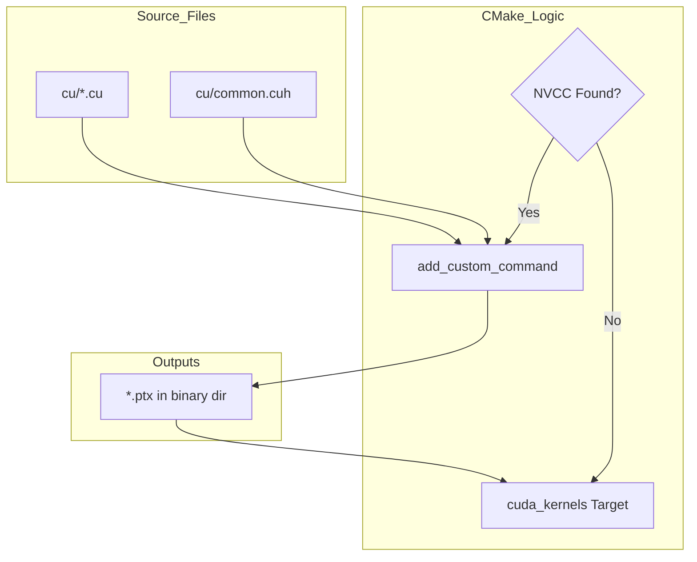
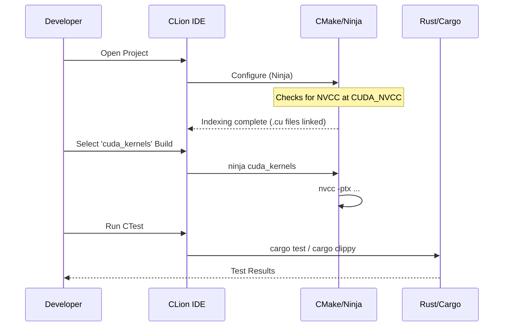

Relevant source files

The following files were used as context for generating this wiki page:

- [CLAUDE.md](CLAUDE.md)
- [REVIEW.md](REVIEW.md)
- [CMakeLists.txt](CMakeLists.txt)
- [README.md](README.md)
- [build.rs](build.rs)
- [AGENTS.md](AGENTS.md)

# CTest & CLion Workflow

The CTest and CLion workflow in `myelin-accelerator` provides a unified interface for managing both Rust-based testing and CUDA kernel compilation. Because native CMake CUDA support (via `project(... CUDA)`) is incompatible with certain host toolchains like GCC 16, the project utilizes a custom `CXX`-only CMake configuration. This configuration drives the `nvcc` compiler through custom commands to produce PTX files while simultaneously exposing Cargo tasks (testing, linting, and benchmarking) as CTest entries.

This integration allows developers to use CLion's built-in test runner and target selector to drive the full lifecycle of the project—from PTX generation to safe FFI wrapper validation—without leaving the IDE environment.

Sources: [REVIEW.md:7-22](REVIEW.md#L7-L22), [CLAUDE.md:67-75](CLAUDE.md#L67-L75), [CMakeLists.txt:1-5](CMakeLists.txt#L1-L5)

## Architecture and Integration

The workflow is anchored by `CMakeLists.txt`, which sidesteps standard CUDA language identification to avoid compiler conflicts. Instead, it treats the project as a C++ (`CXX`) project and manually orchestrates the build of `.cu` files into `.ptx` outputs.

### CUDA Kernel Compilation Flow
The following diagram illustrates how CMake manages the transition from CUDA source files to the PTX modules used by the Rust backend.

The `cuda_kernels` target serves a dual purpose: it builds PTX when `nvcc` is present and acts as an indexing-only target for the IDE to ensure `.cu` and `.cuh` files are properly indexed by CLion.
Sources: [CMakeLists.txt:30-66](CMakeLists.txt#L30-L66), [REVIEW.md:24-34](REVIEW.md#L24-L34)

## CTest Suite Components

The project uses `enable_testing()` and `add_test()` to register various Cargo-based tasks into the CTest framework. This allows `ctest` to act as a top-level quality gate.

| CTest Name | Command Executed | Purpose |
|:---|:---|:---|
| `cargo_tests` | `cargo test --locked` | Runs standard Rust unit and integration tests. |
| `cargo_build_no_default_features` | `cargo build --locked --no-default-features` | Validates the CPU-safe stub path without requiring a GPU. |
| `cargo_fmt_check` | `cargo fmt --check` | Ensures code adheres to project formatting standards. |
| `cargo_clippy_no_default` | `cargo clippy --locked --no-default-features -- -D warnings` | Runs lints on the CPU-safe path. |
| `cargo_build_bench_example` | `cargo build --locked --features bench --example benchmark` | Verifies the benchmark example compiles. |
| `cuda_kernel_build` | `cmake --build . --target cuda_kernels` | Triggers the custom PTX compilation flow. |

Sources: [CMakeLists.txt:80-143](CMakeLists.txt#L80-L143), [REVIEW.md:14-22](REVIEW.md#L14-L22)

## CLion Configuration Requirements

To maintain a functional environment within CLion, specific settings and behaviors must be observed:

*  **Ninja Generator:** CLion defaults to the Ninja generator. Reconfiguring the `cmake-build-debug` directory with Unix Makefiles manually may cause CLion to refuse to reload the project.
*  **Target Selection:** Developers should use the `cuda_kernels` target rather than "New Target" or `add_executable`. The project is intentionally configured to avoid native CMake CUDA targets to bypass host compiler front-end errors.
*  **NVCC Pathing:** The path to `nvcc` can be overridden via the `CUDA_NVCC` CMake cache variable (e.g., `-DCUDA_NVCC=/usr/local/cuda-13.3/bin/nvcc`).

Sources: [REVIEW.md:36-44](REVIEW.md#L36-L44), [CLAUDE.md:12-16](CLAUDE.md#L12-L16), [CMakeLists.txt:10-25](CMakeLists.txt#L10-L25)

## Build Target Synchronization

The project maintains synchronization between the `build.rs` script (used by Cargo) and `CMakeLists.txt` (used by CLion). Both systems are configured to use identical compiler flags to ensure consistent PTX output:

*  **Standard:** `-std=c++17`
*  **Definitions:** `-D__STRICT_ANSI__`
*  **Optimization:** `-O3`, `--use_fast_math`, `--restrict`
*  **Workarounds:** `--allow-unsupported-compiler`, `--expt-relaxed-constexpr`, `-Xcompiler -fno-builtin`

This dual-path approach ensures that a standard `cargo build --features cuda` produces the same PTX artifacts as a CLion `cmake --build` command.
Sources: [build.rs:114-142](build.rs#L114-L142), [CMakeLists.txt:12-25](CMakeLists.txt#L12-L25), [CLAUDE.md:79-83](CLAUDE.md#L79-L83)

## Conclusion

The CTest & CLion workflow provides a robust bridge between the Rust ecosystem and CUDA development. By wrapping `nvcc` and `cargo` commands within a custom CMake structure, the project enables high-performance kernel development for Blackwell GPUs while maintaining the IDE convenience of CLion and the standardized testing capabilities of CTest. This setup is critical for managing the project's "Blackwell-first" requirement without triggering toolchain incompatibilities common in modern C++ environments.
Sources: [README.md:1-5](README.md#L1-L5), [REVIEW.md:71-77](REVIEW.md#L71-L77)
