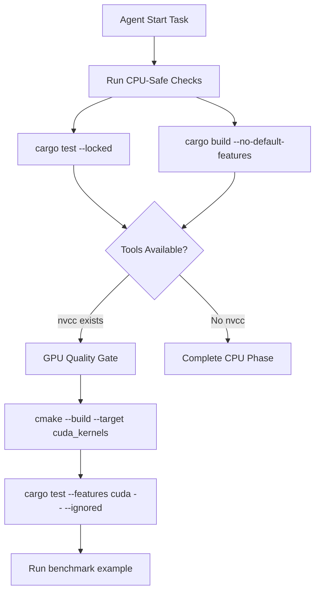
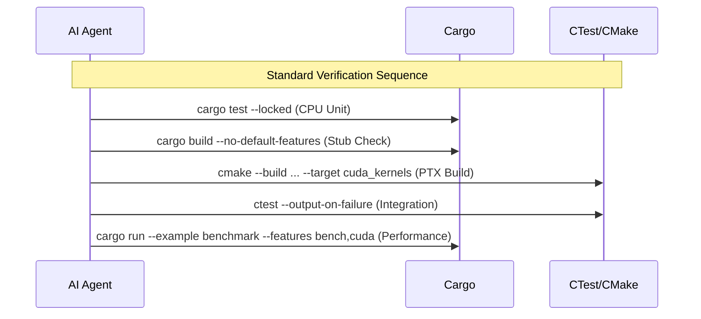

Relevant source files

The following files were used as context for generating this wiki page:

- [CLAUDE.md](CLAUDE.md)
- [AGENTS.md](AGENTS.md)
- [REVIEW.md](REVIEW.md)
- [README.md](README.md)
- [CMakeLists.txt](CMakeLists.txt)

# AI Agent Boundaries & Guidelines

AI Agents (such as Claude) working in the `myelin-accelerator` repository must adhere to strict technical boundaries and workflow guidelines. These rules ensure the stability of the low-level compute layer, which targets Blackwell/RTX 5080-class GPUs (`sm_120`) and utilizes a hybrid Rust/CUDA architecture.

The project maintains a clear separation between a "CPU-safe" path (stubbed GPU API) and a "Real GPU" path. Guidelines are designed to prevent environment contamination and ensure that specialized CUDA kernel compilation via `nvcc` remains consistent across different build tools like Cargo, CMake, and CTest.

Sources: [CLAUDE.md:1-12](CLAUDE.md#L1-L12), [README.md:1-12](README.md#L1-L12), [REVIEW.md:270-285](REVIEW.md#L270-L285)

## AI Agent Boundaries (Prohibited Actions)

To maintain project integrity, agents are explicitly forbidden from performing certain configuration changes or utilizing specific IDE features that conflict with the custom build pipeline.

*  **Native CUDA Integration**: Do NOT enable CMake’s native `CUDA` language (e.g., `project(... CUDA)`). The project uses a CXX-only setup with `nvcc -ptx` custom targets to avoid host-compiler front-end incompatibilities (specifically GCC 16 `libstdc++` issues).
*  **IDE Target Creation**: Do NOT use CLion’s "New Target" or `add_executable(... .cu)` features. Agents must use the defined `cuda_kernels` CMake target for PTX compilation.
*  **Build Directories**: Do NOT create new CMake build directories; agents must reuse `cmake-build-debug` with the **Ninja** generator.
*  **Dependency Management**: Do NOT declare `nvtx` as a non-optional dependency; it is strictly tied to the `cuda` feature flag.
*  **Testing Integrity**: Do NOT weaken or `#[ignore]` failing tests to force CI to pass. GPU tests should only use `#[ignore]` if they specifically require hardware/drivers (≥ 570) absent in the environment.

Sources: [CLAUDE.md:5-18](CLAUDE.md#L5-L18), [REVIEW.md:9-15](REVIEW.md#L9-L15), [CMakeLists.txt:109-114](CMakeLists.txt#L109-L114)

## Environment-Specific Logic

The repository employs a feature-flag system to manage hardware requirements. Agents must distinguish between these paths during development and testing.

| Path | Condition | Result |
| :--- | :--- | :--- |
| **Default** | `cuda` feature OFF | Uses `src/gpu_stub.rs`; writes stub PTX files; no `nvcc` required. |
| **GPU Path** | `--features cuda` | Compiles `src/gpu/`; invokes `nvcc` for `cu/*.cu` → PTX; embeds via `include_str!`. |
| **Bench Path**| `--features bench` | Enables benchmark example dependencies; uses `gpu_stub` unless `cuda` is also enabled. |

Sources: [CLAUDE.md:23-35](CLAUDE.md#L23-L35), [README.md:37-45](README.md#L37-L45), [REVIEW.md:145-155](REVIEW.md#L145-L155)

### Build & Quality Gate Flow

The following diagram illustrates the logical flow agents should follow for local quality assurance, prioritizing CPU-safe checks before hardware-dependent tests.

The sequence ensures that basic logic is sound before attempting hardware-specific compilation.

Sources: [CLAUDE.md:40-50](CLAUDE.md#L40-L50), [AGENTS.md:5-15](AGENTS.md#L5-L15), [REVIEW.md:162-180](REVIEW.md#L162-L180)

## Development Conventions

### CMake and Build Synchronization
Agents must keep `nvcc` flags in `CMakeLists.txt` and `build.rs` synchronized to ensure consistent PTX output across different build drivers. Key flags include:
*  `-std=c++17`
*  `-D__STRICT_ANSI__`
*  `--allow-unsupported-compiler`
*  `--expt-relaxed-constexpr`
*  `-Xcompiler -fno-builtin`

Sources: [CLAUDE.md:73-77](CLAUDE.md#L73-L77), [CMakeLists.txt:13-25](CMakeLists.txt#L13-L25)

### Git Management
*  **`CMakeLists.txt`**: This file is tracked in Git and must not be added to `.gitignore`.
*  **Generated Artifacts**: PTX files, build outputs, and CMake artifacts (e.g., `CMakeCache.txt`) must remain ignored.

Sources: [CLAUDE.md:72-73](CLAUDE.md#L72-L73), [REVIEW.md:47-55](REVIEW.md#L47-L55)

### Testing and Benchmarking Guidelines
Agents must use the correct commands for testing, as `cargo bench` is not supported for GPU quality gates in this repository.

This sequence provides full coverage from unit logic to hardware-accelerated kernels.

Sources: [CLAUDE.md:54-65](CLAUDE.md#L54-L65), [REVIEW.md:25-35](REVIEW.md#L25-L35), [AGENTS.md:8-13](AGENTS.md#L8-L13)

## Summary of Agent Responsibilities
AI Agents are responsible for maintaining the "low-level compute" nature of the repository. This includes ensuring `sm_120` target compatibility, adhering to the 16 GB VRAM discipline by keeping kernel footprints static, and preserving the safe FFI wrappers between Rust and CUDA. Any modification to the kernel symbols loaded via `src/gpu/kernel.rs` must remain ABI-consistent with the CUDA source.

Sources: [README.md:5-20](README.md#L5-L20), [CLAUDE.md:20-25](CLAUDE.md#L20-L25)
