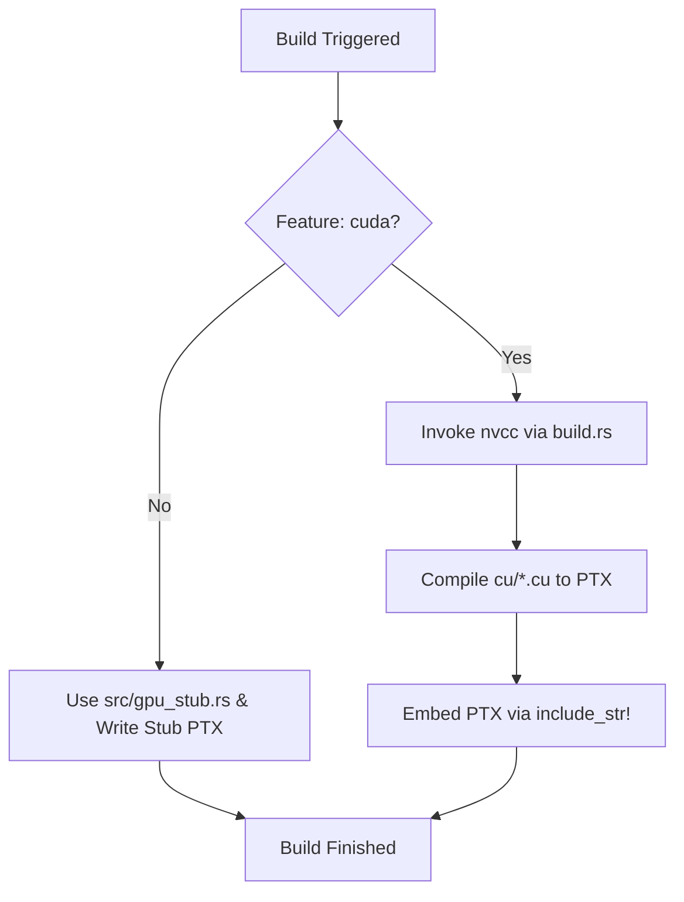
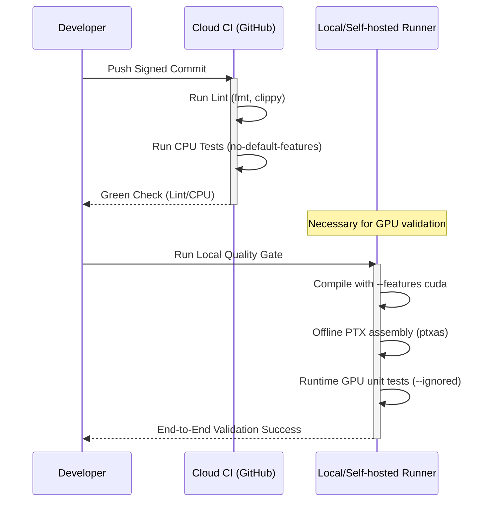

Relevant source files

The following files were used as context for generating this wiki page:

- [CLAUDE.md](CLAUDE.md)
- [REVIEW.md](REVIEW.md)
- [README.md](README.md)
- [build.rs](build.rs)
- [.github/workflows/ci.yml](.github/workflows/ci.yml)

# Commit Signing Requirements

## Introduction

Commit signing requirements for the `myelin-accelerator` project are established to maintain the integrity of the low-level compute layer. The project targets Blackwell / RTX 5080-class hardware and involves complex build pipelines integrating Rust and CUDA kernels. Ensuring that all contributions are signed is critical for a "Tier 1" crate that manages safe FFI wrappers around first-party kernels.

The purpose of these requirements is to validate the authorship and integrity of code changes, particularly those affecting the `sm_120` target kernels, PTX modules, and the custom CMake/Cargo build system. This is especially vital given the project's reliance on local quality gates for GPU runtime proof, as cloud-hosted runners often lack the necessary Blackwell-class hardware.

Sources: [README.md:1-5](README.md#L1-L5), [CLAUDE.md:14-16](CLAUDE.md#L14-L16), [REVIEW.md:214-220](REVIEW.md#L214-L220)

## Build System Integrity and Verification

The project employs a dual build system using `Cargo` and `CMake`. This infrastructure is sensitive to environment configurations, such as the `CUDA_NVCC` path and specific compiler flags (`-std=c++17`, `-D__STRICT_ANSI__`). Signed commits ensure that changes to these critical build files are traceable.

### Build Configuration Logic
The build process varies significantly based on the `cuda` feature flag. The logic is handled primarily in `build.rs` and `CMakeLists.txt`.

*The diagram shows the branching logic between CPU-safe stub builds and real CUDA kernel compilation.*

Sources: [CLAUDE.md:18-24](CLAUDE.md#L18-L24), [build.rs:35-43](build.rs#L35-L43), [REVIEW.md:38-45](REVIEW.md#L38-L45)

## Contribution Quality Gates

Verification of signed contributions occurs through several automated and manual "quality gates." These gates are designed to catch regressions in both the CPU-safe path and the GPU-active path.

| Gate Type | Requirement | Tooling |
| :--- | :--- | :--- |
| **Lint/Static Analysis** | `cargo fmt --check`, `cargo clippy` | GitHub Actions (Cloud CI) |
| **CPU-Safe Tests** | `cargo test --locked` | GitHub Actions / CTest |
| **GPU Runtime Proof** | `sm_120` execution, JIT loading | Local / Self-hosted Runner |
| **PTX Validation** | `ptxas -arch=sm_120` | Local / Self-hosted Runner |

Sources: [CLAUDE.md:34-40](CLAUDE.md#L34-L40), [REVIEW.md:46-55](REVIEW.md#L46-L55), [REVIEW.md:214-225](REVIEW.md#L214-L225)

### Verification Workflow
The following sequence describes how a signed commit is validated through the project's tiered infrastructure.

*This sequence illustrates the separation between cloud-based linting and the local hardware-specific validation required for CUDA kernels.*

Sources: [CLAUDE.md:52-62](CLAUDE.md#L52-L62), [REVIEW.md:214-225](REVIEW.md#L214-L225), [REVIEW.md:255-265](REVIEW.md#L255-L265)

## Configuration and Environment Variables

The project relies on specific environment variables to manage the build environment. Changes to these variables within build scripts or CI workflows must be strictly monitored via signed commits to prevent unauthorized modifications to the build pipeline.

### Key Environment Variables
| Variable | Description |
| :--- | :--- |
| `CUDA_NVCC` | Path to the `nvcc` binary (e.g., `/usr/local/cuda/bin/nvcc`) |
| `MYELIN_CUDA_ARCH` | Targeted GPU architecture (default: `sm_120`) |
| `MYELIN_PTX_VERSION`| Forces a specific PTX ISA version (clamped to ≥ 9.2 for Blackwell) |
| `CUDA_HOME` | Base directory for the CUDA toolkit |

Sources: [build.rs:25-33](build.rs#L25-L33), [build.rs:56-61](build.rs#L56-L61), [REVIEW.md:144-150](REVIEW.md#L144-L150)

## Conclusion

Commit signing is a foundational requirement for `myelin-accelerator` to ensure the security and reliability of its high-performance compute kernels. By enforcing signing, the project protects its complex build logic, environmental configurations, and the integrity of the PTX modules that are JIT-compiled on Blackwell hardware. This practice complements the project's tiered testing strategy, which spans from cloud-hosted lints to local hardware-specific runtime proofs.

Sources: [REVIEW.md:214-220](REVIEW.md#L214-L220), [CLAUDE.md:14-18](CLAUDE.md#L14-L18)
